# The SolveIt Notebooks for Rust — an encyclopedia

**128 Jupyter notebooks**, every one project-authored, every one executed for real against the pure-Rust SUNDIALS 7.8.0 engine on this machine (128/128 green), organized into seven major topics. Each notebook lives in its own tagged subfolder together with its companion player script (`player_<tag>.py`), and each carries a prepended header cell with the exact commands to execute it, display its browser GUI, create/access its movies, and access its data — plus the full player script inline.

Every simulation below was integrated by the vendored pure-Rust port of SUNDIALS 7.8.0 CVODE (BDF + Newton + dense solver) — no C, no FFI, no unsafe code — and every notebook checks its own physics against closed forms before it is allowed to say ok.

## Contents

- **01_planet_mercury_tidal_locking** — 2 notebooks
- **02_solveit_worked_examples** — 19 notebooks
- **03_dynamics_and_routh** — 59 notebooks
- **04_collisions** — 12 notebooks
- **05_mechanism_videos** — 13 notebooks
- **06_rust_compiled_examples** — 6 notebooks
- **07_nbody_rebound_rust** — 17 notebooks
- Appendix A — excluded duplicates
- Appendix B — vendored upstream reference notebooks
- Appendix C — reproduction commands

## 01_planet_mercury_tidal_locking

Planet Mercury's 3:2 spin-orbit capture, computed end to end by the pure-Rust SUNDIALS 7.8.0 CVODE solver: test 1 is the pure two-body story (tidal braking, resonance capture, lock), test 2 adds Einstein's general-relativistic perihelion precession and Jupiter's Laplace-Lagrange secular forcing — the lock follows the precessing ellipse. Each notebook builds its own SQLite database and bakes an animated browser player with a Jump-to-capture button.

### `mercury_test2_jupiter_gr`

This is test 2 of the planet_Mercury project. Test 1 established, with a pure two-body model, that the Sun's tides braked Mercury's spin until the Sun's grip on Mercury's slightly lopsided shape snapped it into the strange 3:2 spin-orbit resonance — three spins for every two trips around the Sun. Test 2 now adds the two pieces of physics test 1 deliberately excluded: 1. Einstein's general-relativistic correction. Near the Sun, gravity is    very slightly stronger than Newton's law says. The orbit stays an ellipse,    but the ellipse's long axis slowly swings around — the famous    43 arcseconds per century of extra perihelion advance that Newtonian    physics could not explain and Einstein's…

- **Executed**: PASS — every cell green (17 code cells)
- **Copy**: `SolveIt_Notebooks_for_rust/01_planet_mercury_tidal_locking/mercury_test2_jupiter_gr/mercury_test2_jupiter_gr.ipynb` (header cell prepended: run commands, GUI commands, movies, data access, full player script)
- **Canonical source**: `planet_Mercury/notebook/mercury_test2_jupiter_gr.ipynb`
- **Database**: `planet_Mercury/data/mercury_test2.sqlite3` (SQLite)
- **Player**: `python3 SolveIt_Notebooks_for_rust/01_planet_mercury_tidal_locking/mercury_test2_jupiter_gr/player_mercury_test2_jupiter_gr.py run|gui|jump|capture out.png|data outdir`

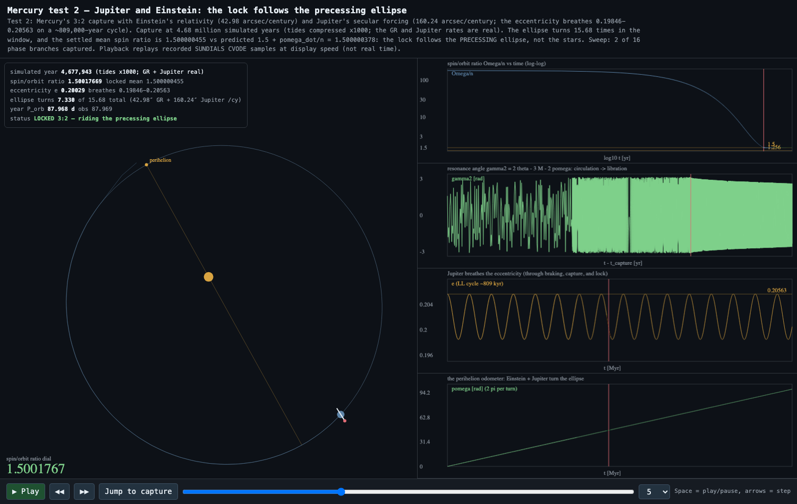

### `mercury_tidal_locking`

Mercury spins on its axis exactly three times for every two trips around the Sun — a "3:2 spin-orbit resonance," which is Mercury's strange form of tidal locking (our Moon, by contrast, is locked 1:1 and always shows Earth one face). This notebook simulates how that happened: the Sun's tides slowly braked Mercury's once-fast spin over billions of years, until the Sun's gravitational grip on Mercury's slightly lopsided shape snapped the spin into step as it fell through the 3:2 ratio.

- **Executed**: PASS — every cell green (18 code cells)
- **Copy**: `SolveIt_Notebooks_for_rust/01_planet_mercury_tidal_locking/mercury_tidal_locking/mercury_tidal_locking.ipynb` (header cell prepended: run commands, GUI commands, movies, data access, full player script)
- **Canonical source**: `planet_Mercury/notebook/mercury_tidal_locking.ipynb`
- **Database**: `planet_Mercury/data/mercury_orbit.sqlite3` (SQLite)
- **Player**: `python3 SolveIt_Notebooks_for_rust/01_planet_mercury_tidal_locking/mercury_tidal_locking/player_mercury_tidal_locking.py run|gui|jump|capture out.png|data outdir`

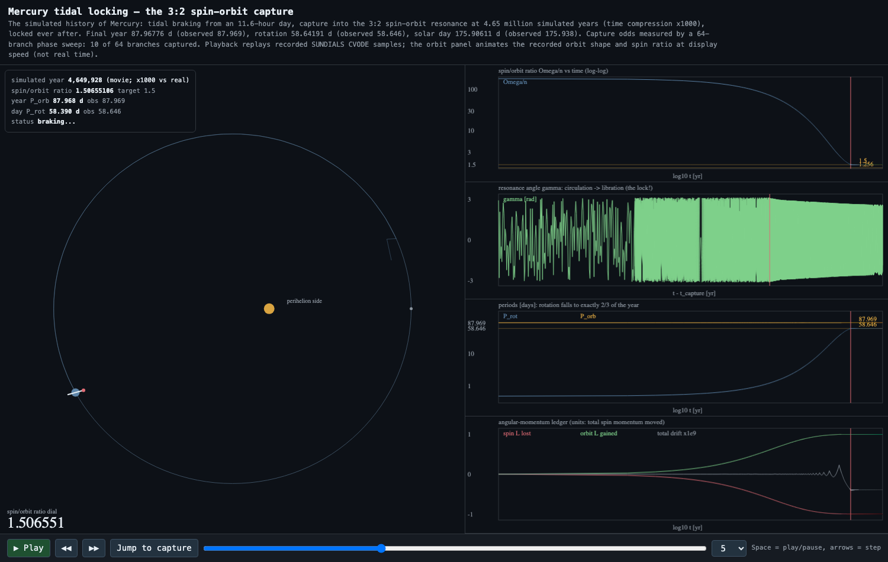

## 02_solveit_worked_examples

The SolveIt worked examples: each notebook drives the posim simulator (pure-Rust SUNDIALS backend) through one classic physics problem with closed-form answers checked in the transcript.

### `solveit_01_elastic_head_on`

This notebook is one half of a pair. The other half is the example file scripts/solveit/01_elastic_head_on.posim in this repository, which contains the same simulation written directly in the simulator's own command language. This notebook runs that same simulation from Python, and explains every line of it.

- **Executed**: PASS — every cell green (9 code cells)
- **Copy**: `SolveIt_Notebooks_for_rust/02_solveit_worked_examples/solveit_01_elastic_head_on/solveit_01_elastic_head_on.ipynb` (header cell prepended: run commands, GUI commands, movies, data access, full player script)
- **Canonical source**: `rustSolveIt_macos-silicon_SUNDIALS_7_8_0/notebooks/solveit_01_elastic_head_on.ipynb`
- **Paired scene/source**: `rustSolveIt_macos-silicon_SUNDIALS_7_8_0/scripts/solveit/01_elastic_head_on.posim`
- **Player**: `python3 SolveIt_Notebooks_for_rust/02_solveit_worked_examples/solveit_01_elastic_head_on/player_solveit_01_elastic_head_on.py run|gui|jump|capture out.png|data outdir`

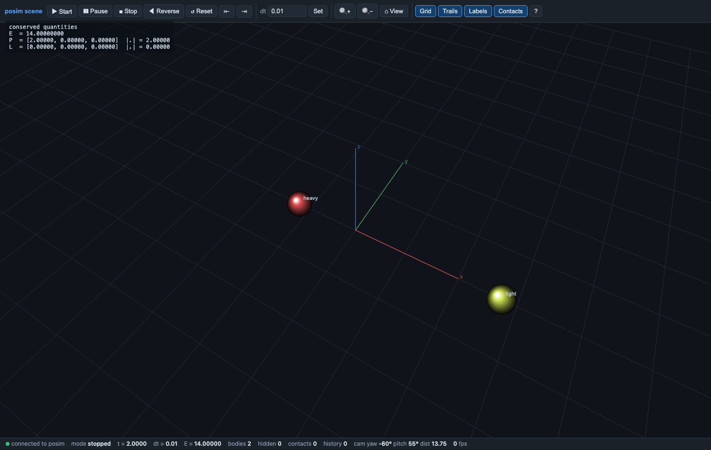

### `solveit_02_keplers_third_law`

This notebook is one half of a pair. The other half is the example file scripts/solveit/02_keplers_third_law.posim in this repository, which contains the same simulation written directly in the simulator's own command language. This notebook runs that same simulation from Python, and explains every line of it.

- **Executed**: PASS — every cell green (19 code cells)
- **Copy**: `SolveIt_Notebooks_for_rust/02_solveit_worked_examples/solveit_02_keplers_third_law/solveit_02_keplers_third_law.ipynb` (header cell prepended: run commands, GUI commands, movies, data access, full player script)
- **Canonical source**: `rustSolveIt_macos-silicon_SUNDIALS_7_8_0/notebooks/solveit_02_keplers_third_law.ipynb`
- **Paired scene/source**: `rustSolveIt_macos-silicon_SUNDIALS_7_8_0/scripts/solveit/02_keplers_third_law.posim`
- **Player**: `python3 SolveIt_Notebooks_for_rust/02_solveit_worked_examples/solveit_02_keplers_third_law/player_solveit_02_keplers_third_law.py run|gui|jump|capture out.png|data outdir`

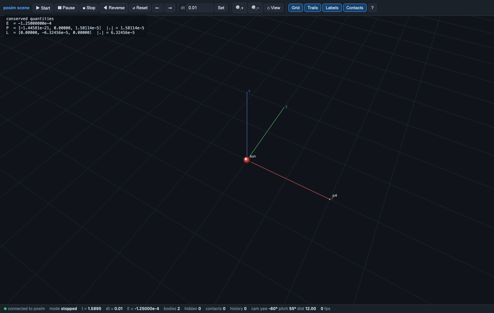

### `solveit_03_three_conics`

This notebook is one half of a pair. The other half is the example file scripts/solveit/03_three_conics.posim in this repository, which contains the same simulation written directly in the simulator's own command language. This notebook runs that same simulation from Python, and explains every line of it.

- **Executed**: PASS — every cell green (6 code cells)
- **Copy**: `SolveIt_Notebooks_for_rust/02_solveit_worked_examples/solveit_03_three_conics/solveit_03_three_conics.ipynb` (header cell prepended: run commands, GUI commands, movies, data access, full player script)
- **Canonical source**: `rustSolveIt_macos-silicon_SUNDIALS_7_8_0/notebooks/solveit_03_three_conics.ipynb`
- **Paired scene/source**: `rustSolveIt_macos-silicon_SUNDIALS_7_8_0/scripts/solveit/03_three_conics.posim`
- **Player**: `python3 SolveIt_Notebooks_for_rust/02_solveit_worked_examples/solveit_03_three_conics/player_solveit_03_three_conics.py run|gui|jump|capture out.png|data outdir`

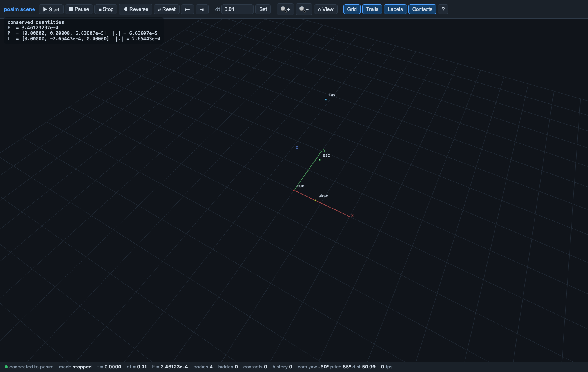

### `solveit_04_restitution_ladder`

This notebook is one half of a pair. The other half is the example file scripts/solveit/04_restitution_ladder.posim in this repository, which contains the same simulation written directly in the simulator's own command language. This notebook runs that same simulation from Python, and explains every line of it.

- **Executed**: PASS — every cell green (10 code cells)
- **Copy**: `SolveIt_Notebooks_for_rust/02_solveit_worked_examples/solveit_04_restitution_ladder/solveit_04_restitution_ladder.ipynb` (header cell prepended: run commands, GUI commands, movies, data access, full player script)
- **Canonical source**: `rustSolveIt_macos-silicon_SUNDIALS_7_8_0/notebooks/solveit_04_restitution_ladder.ipynb`
- **Paired scene/source**: `rustSolveIt_macos-silicon_SUNDIALS_7_8_0/scripts/solveit/04_restitution_ladder.posim`
- **Player**: `python3 SolveIt_Notebooks_for_rust/02_solveit_worked_examples/solveit_04_restitution_ladder/player_solveit_04_restitution_ladder.py run|gui|jump|capture out.png|data outdir`

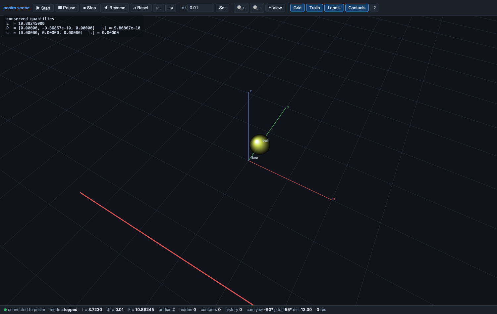

### `solveit_05_cyclotron_bdf`

This notebook is one half of a pair. The other half is the example file scripts/solveit/05_cyclotron_bdf.posim in this repository, which contains the same simulation written directly in the simulator's own command language. This notebook runs that same simulation from Python, and explains every line of it.

- **Executed**: PASS — every cell green (9 code cells)
- **Copy**: `SolveIt_Notebooks_for_rust/02_solveit_worked_examples/solveit_05_cyclotron_bdf/solveit_05_cyclotron_bdf.ipynb` (header cell prepended: run commands, GUI commands, movies, data access, full player script)
- **Canonical source**: `rustSolveIt_macos-silicon_SUNDIALS_7_8_0/notebooks/solveit_05_cyclotron_bdf.ipynb`
- **Paired scene/source**: `rustSolveIt_macos-silicon_SUNDIALS_7_8_0/scripts/solveit/05_cyclotron_bdf.posim`
- **Player**: `python3 SolveIt_Notebooks_for_rust/02_solveit_worked_examples/solveit_05_cyclotron_bdf/player_solveit_05_cyclotron_bdf.py run|gui|jump|capture out.png|data outdir`

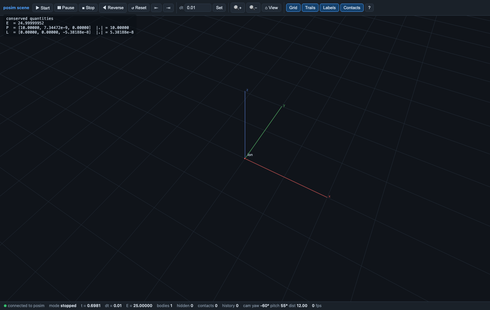

### `solveit_06_symplectic_vs_adaptive`

This notebook is one half of a pair. The other half is the example file scripts/solveit/06_symplectic_vs_adaptive.posim in this repository, which contains the same simulation written directly in the simulator's own command language. This notebook runs that same simulation from Python, and explains every line of it.

- **Executed**: PASS — every cell green (12 code cells)
- **Copy**: `SolveIt_Notebooks_for_rust/02_solveit_worked_examples/solveit_06_symplectic_vs_adaptive/solveit_06_symplectic_vs_adaptive.ipynb` (header cell prepended: run commands, GUI commands, movies, data access, full player script)
- **Canonical source**: `rustSolveIt_macos-silicon_SUNDIALS_7_8_0/notebooks/solveit_06_symplectic_vs_adaptive.ipynb`
- **Paired scene/source**: `rustSolveIt_macos-silicon_SUNDIALS_7_8_0/scripts/solveit/06_symplectic_vs_adaptive.posim`
- **Player**: `python3 SolveIt_Notebooks_for_rust/02_solveit_worked_examples/solveit_06_symplectic_vs_adaptive/player_solveit_06_symplectic_vs_adaptive.py run|gui|jump|capture out.png|data outdir`


### `solveit_07_dzhanibekov`

This notebook is one half of a pair. The other half is the example file scripts/solveit/07_dzhanibekov.posim in this repository, which contains the same simulation written directly in the simulator's own command language. This notebook runs that same simulation from Python, and explains every line of it.

- **Executed**: PASS — every cell green (20 code cells)
- **Copy**: `SolveIt_Notebooks_for_rust/02_solveit_worked_examples/solveit_07_dzhanibekov/solveit_07_dzhanibekov.ipynb` (header cell prepended: run commands, GUI commands, movies, data access, full player script)
- **Canonical source**: `rustSolveIt_macos-silicon_SUNDIALS_7_8_0/notebooks/solveit_07_dzhanibekov.ipynb`
- **Paired scene/source**: `rustSolveIt_macos-silicon_SUNDIALS_7_8_0/scripts/solveit/07_dzhanibekov.posim`
- **Player**: `python3 SolveIt_Notebooks_for_rust/02_solveit_worked_examples/solveit_07_dzhanibekov/player_solveit_07_dzhanibekov.py run|gui|jump|capture out.png|data outdir`


### `solveit_08_magnetic_torque`

This notebook is one half of a pair. The other half is the example file scripts/solveit/08_magnetic_torque.posim in this repository, which contains the same simulation written directly in the simulator's own command language. This notebook runs that same simulation from Python, and explains every line of it.

- **Executed**: PASS — every cell green (7 code cells)
- **Copy**: `SolveIt_Notebooks_for_rust/02_solveit_worked_examples/solveit_08_magnetic_torque/solveit_08_magnetic_torque.ipynb` (header cell prepended: run commands, GUI commands, movies, data access, full player script)
- **Canonical source**: `rustSolveIt_macos-silicon_SUNDIALS_7_8_0/notebooks/solveit_08_magnetic_torque.ipynb`
- **Paired scene/source**: `rustSolveIt_macos-silicon_SUNDIALS_7_8_0/scripts/solveit/08_magnetic_torque.posim`
- **Player**: `python3 SolveIt_Notebooks_for_rust/02_solveit_worked_examples/solveit_08_magnetic_torque/player_solveit_08_magnetic_torque.py run|gui|jump|capture out.png|data outdir`


### `solveit_09_newtons_cradle`

This notebook is one half of a pair. The other half is the example file scripts/solveit/09_newtons_cradle.posim in this repository, which contains the same simulation written directly in the simulator's own command language. This notebook runs that same simulation from Python, and explains every line of it.

- **Executed**: PASS — every cell green (9 code cells)
- **Copy**: `SolveIt_Notebooks_for_rust/02_solveit_worked_examples/solveit_09_newtons_cradle/solveit_09_newtons_cradle.ipynb` (header cell prepended: run commands, GUI commands, movies, data access, full player script)
- **Canonical source**: `rustSolveIt_macos-silicon_SUNDIALS_7_8_0/notebooks/solveit_09_newtons_cradle.ipynb`
- **Paired scene/source**: `rustSolveIt_macos-silicon_SUNDIALS_7_8_0/scripts/solveit/09_newtons_cradle.posim`
- **Player**: `python3 SolveIt_Notebooks_for_rust/02_solveit_worked_examples/solveit_09_newtons_cradle/player_solveit_09_newtons_cradle.py run|gui|jump|capture out.png|data outdir`

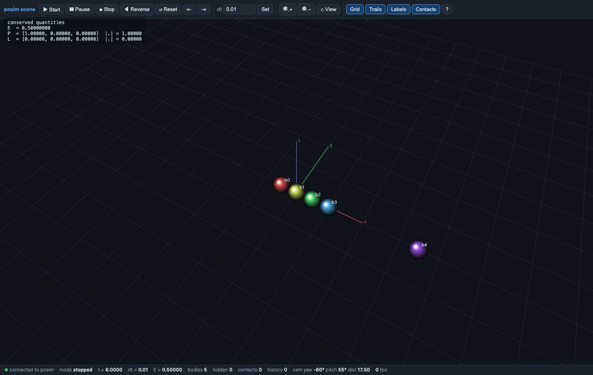

### `solveit_10_no_tunnelling`

This notebook is one half of a pair. The other half is the example file scripts/solveit/10_no_tunnelling.posim in this repository, which contains the same simulation written directly in the simulator's own command language. This notebook runs that same simulation from Python, and explains every line of it.

- **Executed**: PASS — every cell green (6 code cells)
- **Copy**: `SolveIt_Notebooks_for_rust/02_solveit_worked_examples/solveit_10_no_tunnelling/solveit_10_no_tunnelling.ipynb` (header cell prepended: run commands, GUI commands, movies, data access, full player script)
- **Canonical source**: `rustSolveIt_macos-silicon_SUNDIALS_7_8_0/notebooks/solveit_10_no_tunnelling.ipynb`
- **Paired scene/source**: `rustSolveIt_macos-silicon_SUNDIALS_7_8_0/scripts/solveit/10_no_tunnelling.posim`
- **Player**: `python3 SolveIt_Notebooks_for_rust/02_solveit_worked_examples/solveit_10_no_tunnelling/player_solveit_10_no_tunnelling.py run|gui|jump|capture out.png|data outdir`

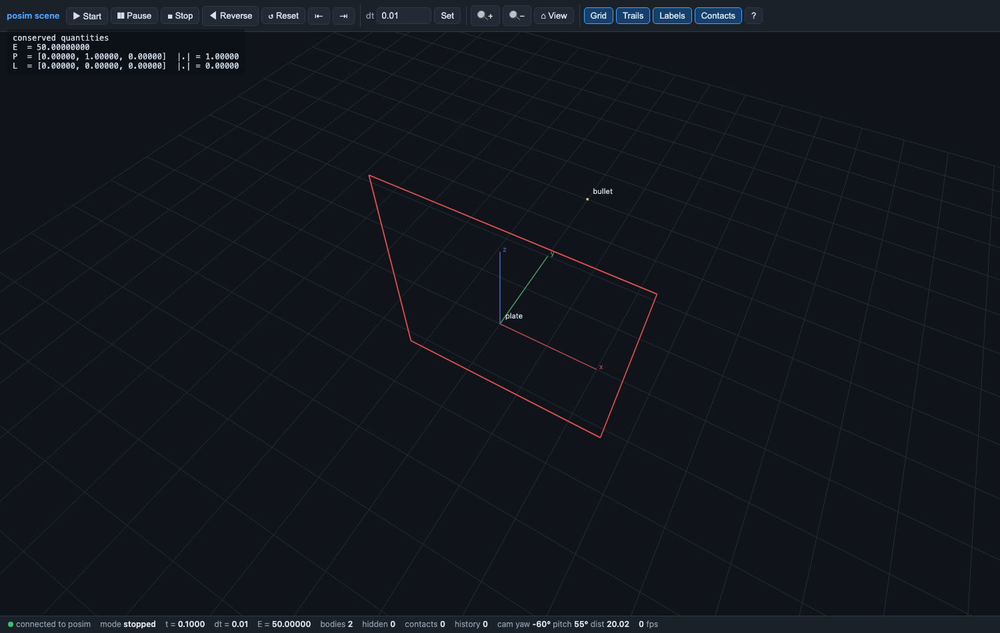

### `solveit_11_lagrange_l4`

This notebook is one half of a pair. The other half is the example file scripts/solveit/11_lagrange_l4.posim in this repository, which contains the same simulation written directly in the simulator's own command language. This notebook runs that same simulation from Python, and explains every line of it.

- **Executed**: PASS — every cell green (8 code cells)
- **Copy**: `SolveIt_Notebooks_for_rust/02_solveit_worked_examples/solveit_11_lagrange_l4/solveit_11_lagrange_l4.ipynb` (header cell prepended: run commands, GUI commands, movies, data access, full player script)
- **Canonical source**: `rustSolveIt_macos-silicon_SUNDIALS_7_8_0/notebooks/solveit_11_lagrange_l4.ipynb`
- **Paired scene/source**: `rustSolveIt_macos-silicon_SUNDIALS_7_8_0/scripts/solveit/11_lagrange_l4.posim`
- **Player**: `python3 SolveIt_Notebooks_for_rust/02_solveit_worked_examples/solveit_11_lagrange_l4/player_solveit_11_lagrange_l4.py run|gui|jump|capture out.png|data outdir`

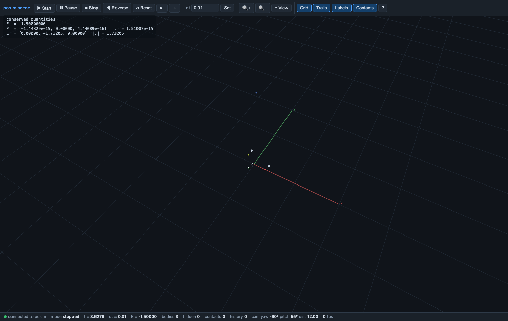

### `solveit_12_dumbbell_inertia`

This notebook is one half of a pair. The other half is the example file scripts/solveit/12_dumbbell_inertia.posim in this repository, which contains the same simulation written directly in the simulator's own command language. This notebook runs that same simulation from Python, and explains every line of it.

- **Executed**: PASS — every cell green (6 code cells)
- **Copy**: `SolveIt_Notebooks_for_rust/02_solveit_worked_examples/solveit_12_dumbbell_inertia/solveit_12_dumbbell_inertia.ipynb` (header cell prepended: run commands, GUI commands, movies, data access, full player script)
- **Canonical source**: `rustSolveIt_macos-silicon_SUNDIALS_7_8_0/notebooks/solveit_12_dumbbell_inertia.ipynb`
- **Paired scene/source**: `rustSolveIt_macos-silicon_SUNDIALS_7_8_0/scripts/solveit/12_dumbbell_inertia.posim`
- **Player**: `python3 SolveIt_Notebooks_for_rust/02_solveit_worked_examples/solveit_12_dumbbell_inertia/player_solveit_12_dumbbell_inertia.py run|gui|jump|capture out.png|data outdir`

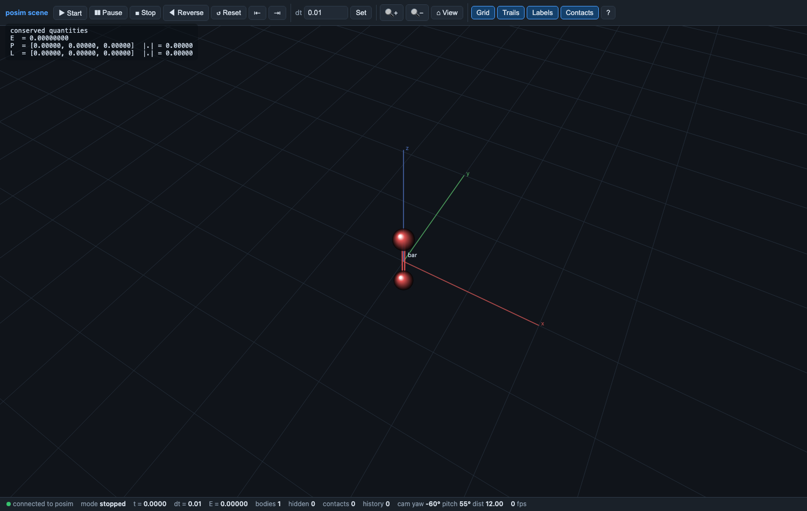

### `solveit_13_tilted_torus`

This notebook is one half of a pair. The other half is the example file scripts/solveit/13_tilted_torus.posim in this repository, which contains the same simulation written directly in the simulator's own command language. This notebook runs that same simulation from Python, and explains every line of it.

- **Executed**: PASS — every cell green (9 code cells)
- **Copy**: `SolveIt_Notebooks_for_rust/02_solveit_worked_examples/solveit_13_tilted_torus/solveit_13_tilted_torus.ipynb` (header cell prepended: run commands, GUI commands, movies, data access, full player script)
- **Canonical source**: `rustSolveIt_macos-silicon_SUNDIALS_7_8_0/notebooks/solveit_13_tilted_torus.ipynb`
- **Paired scene/source**: `rustSolveIt_macos-silicon_SUNDIALS_7_8_0/scripts/solveit/13_tilted_torus.posim`
- **Player**: `python3 SolveIt_Notebooks_for_rust/02_solveit_worked_examples/solveit_13_tilted_torus/player_solveit_13_tilted_torus.py run|gui|jump|capture out.png|data outdir`

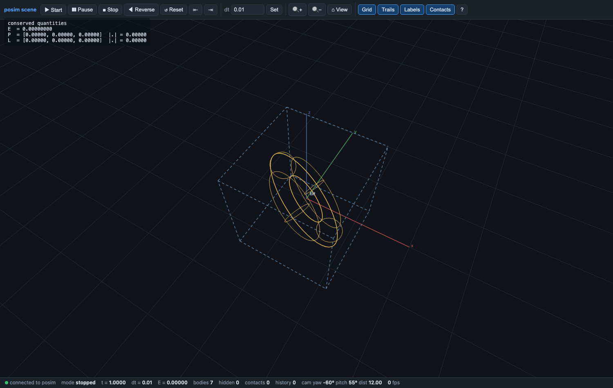

### `solveit_14_particle_in_a_box`

This notebook is one half of a pair. The other half is the example file scripts/solveit/14_particle_in_a_box.posim in this repository, which contains the same simulation written directly in the simulator's own command language. This notebook runs that same simulation from Python, and explains every line of it.

- **Executed**: PASS — every cell green (7 code cells)
- **Copy**: `SolveIt_Notebooks_for_rust/02_solveit_worked_examples/solveit_14_particle_in_a_box/solveit_14_particle_in_a_box.ipynb` (header cell prepended: run commands, GUI commands, movies, data access, full player script)
- **Canonical source**: `rustSolveIt_macos-silicon_SUNDIALS_7_8_0/notebooks/solveit_14_particle_in_a_box.ipynb`
- **Paired scene/source**: `rustSolveIt_macos-silicon_SUNDIALS_7_8_0/scripts/solveit/14_particle_in_a_box.posim`
- **Player**: `python3 SolveIt_Notebooks_for_rust/02_solveit_worked_examples/solveit_14_particle_in_a_box/player_solveit_14_particle_in_a_box.py run|gui|jump|capture out.png|data outdir`


### `solveit_15_tunnelling`

This notebook is one half of a pair. The other half is the example file scripts/solveit/15_tunnelling.posim in this repository, which contains the same simulation written directly in the simulator's own command language. This notebook runs that same simulation from Python, and explains every line of it.

- **Executed**: PASS — every cell green (9 code cells)
- **Copy**: `SolveIt_Notebooks_for_rust/02_solveit_worked_examples/solveit_15_tunnelling/solveit_15_tunnelling.ipynb` (header cell prepended: run commands, GUI commands, movies, data access, full player script)
- **Canonical source**: `rustSolveIt_macos-silicon_SUNDIALS_7_8_0/notebooks/solveit_15_tunnelling.ipynb`
- **Paired scene/source**: `rustSolveIt_macos-silicon_SUNDIALS_7_8_0/scripts/solveit/15_tunnelling.posim`
- **Player**: `python3 SolveIt_Notebooks_for_rust/02_solveit_worked_examples/solveit_15_tunnelling/player_solveit_15_tunnelling.py run|gui|jump|capture out.png|data outdir`


### `solveit_16_special_functions`

This notebook is one half of a pair. The other half is the example file scripts/solveit/16_special_functions.posim in this repository, which contains the same simulation written directly in the simulator's own command language. This notebook runs that same simulation from Python, and explains every line of it.

- **Executed**: PASS — every cell green (9 code cells)
- **Copy**: `SolveIt_Notebooks_for_rust/02_solveit_worked_examples/solveit_16_special_functions/solveit_16_special_functions.ipynb` (header cell prepended: run commands, GUI commands, movies, data access, full player script)
- **Canonical source**: `rustSolveIt_macos-silicon_SUNDIALS_7_8_0/notebooks/solveit_16_special_functions.ipynb`
- **Paired scene/source**: `rustSolveIt_macos-silicon_SUNDIALS_7_8_0/scripts/solveit/16_special_functions.posim`
- **Player**: `python3 SolveIt_Notebooks_for_rust/02_solveit_worked_examples/solveit_16_special_functions/player_solveit_16_special_functions.py run|gui|jump|capture out.png|data outdir`


### `solveit_17_pendulum_dae`

This notebook is one half of a pair. The other half is the example file scripts/solveit/17_pendulum_dae.posim in this repository, which contains the same simulation written directly in the simulator's own command language. This notebook runs that same simulation from Python, and explains every line of it.

- **Executed**: PASS — every cell green (10 code cells)
- **Copy**: `SolveIt_Notebooks_for_rust/02_solveit_worked_examples/solveit_17_pendulum_dae/solveit_17_pendulum_dae.ipynb` (header cell prepended: run commands, GUI commands, movies, data access, full player script)
- **Canonical source**: `rustSolveIt_macos-silicon_SUNDIALS_7_8_0/notebooks/solveit_17_pendulum_dae.ipynb`
- **Paired scene/source**: `rustSolveIt_macos-silicon_SUNDIALS_7_8_0/scripts/solveit/17_pendulum_dae.posim`
- **Player**: `python3 SolveIt_Notebooks_for_rust/02_solveit_worked_examples/solveit_17_pendulum_dae/player_solveit_17_pendulum_dae.py run|gui|jump|capture out.png|data outdir`


### `solveit_18_equilibrium_and_sensitivity`

This notebook is one half of a pair. The other half is the example file scripts/solveit/18_equilibrium_and_sensitivity.posim in this repository, which contains the same simulation written directly in the simulator's own command language. This notebook runs that same simulation from Python, and explains every line of it.

- **Executed**: PASS — every cell green (12 code cells)
- **Copy**: `SolveIt_Notebooks_for_rust/02_solveit_worked_examples/solveit_18_equilibrium_and_sensitivity/solveit_18_equilibrium_and_sensitivity.ipynb` (header cell prepended: run commands, GUI commands, movies, data access, full player script)
- **Canonical source**: `rustSolveIt_macos-silicon_SUNDIALS_7_8_0/notebooks/solveit_18_equilibrium_and_sensitivity.ipynb`
- **Paired scene/source**: `rustSolveIt_macos-silicon_SUNDIALS_7_8_0/scripts/solveit/18_equilibrium_and_sensitivity.posim`
- **Player**: `python3 SolveIt_Notebooks_for_rust/02_solveit_worked_examples/solveit_18_equilibrium_and_sensitivity/player_solveit_18_equilibrium_and_sensitivity.py run|gui|jump|capture out.png|data outdir`

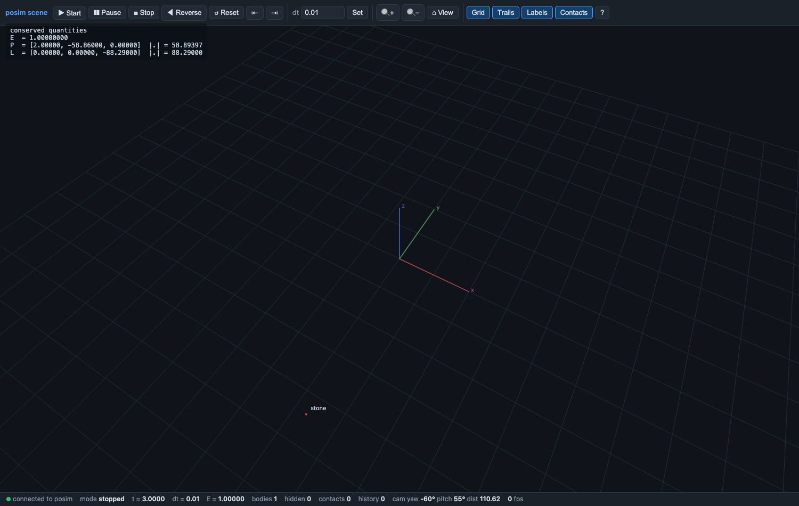

### `solveit_19_hinged_door`

This notebook is one half of a pair. The other half is the example file scripts/solveit/19_hinged_door.posim in this repository, which contains the same simulation written directly in the simulator's own command language. This notebook runs that same simulation from Python, and explains every line of it.

- **Executed**: PASS — every cell green (10 code cells)
- **Copy**: `SolveIt_Notebooks_for_rust/02_solveit_worked_examples/solveit_19_hinged_door/solveit_19_hinged_door.ipynb` (header cell prepended: run commands, GUI commands, movies, data access, full player script)
- **Canonical source**: `rustSolveIt_macos-silicon_SUNDIALS_7_8_0/notebooks/solveit_19_hinged_door.ipynb`
- **Paired scene/source**: `rustSolveIt_macos-silicon_SUNDIALS_7_8_0/scripts/solveit/19_hinged_door.posim`
- **Player**: `python3 SolveIt_Notebooks_for_rust/02_solveit_worked_examples/solveit_19_hinged_door/player_solveit_19_hinged_door.py run|gui|jump|capture out.png|data outdir`

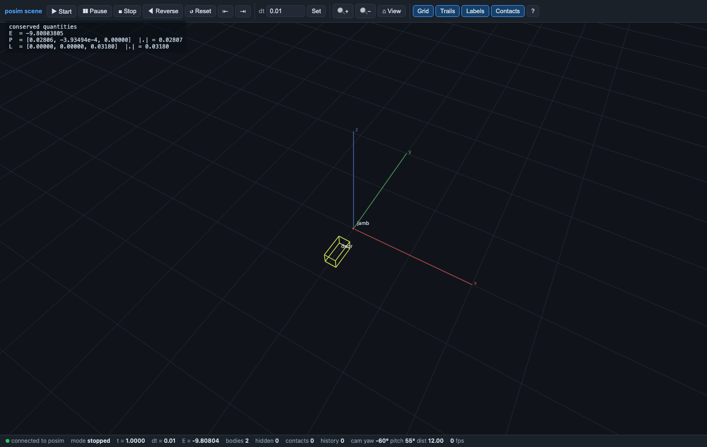

## 03_dynamics_and_routh

The dynamic notebooks — free rigid-body motion, charged particles in fields, orbital mechanics, and the 34 Routh rigid-body problems — each a machine-mode posim session with its analytic checks.

### `dynamic_billiard_box`

This notebook is one half of a pair. The other half is the example file dynamic_notebooks/billiard_box.posim in this repository, which contains the same simulation written directly in the simulator's own command language. This notebook runs that same simulation from Python, and explains every line of it.

- **Executed**: PASS — every cell green (7 code cells)
- **Copy**: `SolveIt_Notebooks_for_rust/03_dynamics_and_routh/dynamic_billiard_box/dynamic_billiard_box.ipynb` (header cell prepended: run commands, GUI commands, movies, data access, full player script)
- **Canonical source**: `rustSolveIt_macos-silicon_SUNDIALS_7_8_0/notebooks/dynamic_billiard_box.ipynb`
- **Paired scene/source**: `rustSolveIt_macos-silicon_SUNDIALS_7_8_0/dynamic_notebooks/billiard_box.posim`
- **Player**: `python3 SolveIt_Notebooks_for_rust/03_dynamics_and_routh/dynamic_billiard_box/player_dynamic_billiard_box.py run|gui|jump|capture out.png|data outdir`


### `dynamic_billiard_break`

This notebook is one half of a pair. The other half is the example file dynamic_notebooks/billiard_break.posim in this repository, which contains the same simulation written directly in the simulator's own command language. This notebook runs that same simulation from Python, and explains every line of it.

- **Executed**: PASS — every cell green (6 code cells)
- **Copy**: `SolveIt_Notebooks_for_rust/03_dynamics_and_routh/dynamic_billiard_break/dynamic_billiard_break.ipynb` (header cell prepended: run commands, GUI commands, movies, data access, full player script)
- **Canonical source**: `rustSolveIt_macos-silicon_SUNDIALS_7_8_0/notebooks/dynamic_billiard_break.ipynb`
- **Paired scene/source**: `rustSolveIt_macos-silicon_SUNDIALS_7_8_0/dynamic_notebooks/billiard_break.posim`
- **Player**: `python3 SolveIt_Notebooks_for_rust/03_dynamics_and_routh/dynamic_billiard_break/player_dynamic_billiard_break.py run|gui|jump|capture out.png|data outdir`


### `dynamic_bouncing_ball_restitution`

This notebook is one half of a pair. The other half is the example file dynamic_notebooks/bouncing_ball_restitution.posim in this repository, which contains the same simulation written directly in the simulator's own command language. This notebook runs that same simulation from Python, and explains every line of it.

- **Executed**: PASS — every cell green (10 code cells)
- **Copy**: `SolveIt_Notebooks_for_rust/03_dynamics_and_routh/dynamic_bouncing_ball_restitution/dynamic_bouncing_ball_restitution.ipynb` (header cell prepended: run commands, GUI commands, movies, data access, full player script)
- **Canonical source**: `rustSolveIt_macos-silicon_SUNDIALS_7_8_0/notebooks/dynamic_bouncing_ball_restitution.ipynb`
- **Paired scene/source**: `rustSolveIt_macos-silicon_SUNDIALS_7_8_0/dynamic_notebooks/bouncing_ball_restitution.posim`
- **Player**: `python3 SolveIt_Notebooks_for_rust/03_dynamics_and_routh/dynamic_bouncing_ball_restitution/player_dynamic_bouncing_ball_restitution.py run|gui|jump|capture out.png|data outdir`


### `dynamic_box_of_shapes`

This notebook is one half of a pair. The other half is the example file dynamic_notebooks/box_of_shapes.posim in this repository, which contains the same simulation written directly in the simulator's own command language. This notebook runs that same simulation from Python, and explains every line of it.

- **Executed**: PASS — every cell green (11 code cells)
- **Copy**: `SolveIt_Notebooks_for_rust/03_dynamics_and_routh/dynamic_box_of_shapes/dynamic_box_of_shapes.ipynb` (header cell prepended: run commands, GUI commands, movies, data access, full player script)
- **Canonical source**: `rustSolveIt_macos-silicon_SUNDIALS_7_8_0/notebooks/dynamic_box_of_shapes.ipynb`
- **Paired scene/source**: `rustSolveIt_macos-silicon_SUNDIALS_7_8_0/dynamic_notebooks/box_of_shapes.posim`
- **Player**: `python3 SolveIt_Notebooks_for_rust/03_dynamics_and_routh/dynamic_box_of_shapes/player_dynamic_box_of_shapes.py run|gui|jump|capture out.png|data outdir`


### `dynamic_box_of_shapes_m32`

This notebook is one half of a pair. The other half is the example file dynamic_notebooks/box_of_shapes_m32.posim in this repository, which contains the same simulation written directly in the simulator's own command language. This notebook runs that same simulation from Python, and explains every line of it.

- **Executed**: PASS — every cell green (11 code cells)
- **Copy**: `SolveIt_Notebooks_for_rust/03_dynamics_and_routh/dynamic_box_of_shapes_m32/dynamic_box_of_shapes_m32.ipynb` (header cell prepended: run commands, GUI commands, movies, data access, full player script)
- **Canonical source**: `rustSolveIt_macos-silicon_SUNDIALS_7_8_0/notebooks/dynamic_box_of_shapes_m32.ipynb`
- **Paired scene/source**: `rustSolveIt_macos-silicon_SUNDIALS_7_8_0/dynamic_notebooks/box_of_shapes_m32.posim`
- **Player**: `python3 SolveIt_Notebooks_for_rust/03_dynamics_and_routh/dynamic_box_of_shapes_m32/player_dynamic_box_of_shapes_m32.py run|gui|jump|capture out.png|data outdir`


### `dynamic_charged_in_b_field`

This notebook is one half of a pair. The other half is the example file dynamic_notebooks/charged_in_b_field.posim in this repository, which contains the same simulation written directly in the simulator's own command language. This notebook runs that same simulation from Python, and explains every line of it.

- **Executed**: PASS — every cell green (10 code cells)
- **Copy**: `SolveIt_Notebooks_for_rust/03_dynamics_and_routh/dynamic_charged_in_b_field/dynamic_charged_in_b_field.ipynb` (header cell prepended: run commands, GUI commands, movies, data access, full player script)
- **Canonical source**: `rustSolveIt_macos-silicon_SUNDIALS_7_8_0/notebooks/dynamic_charged_in_b_field.ipynb`
- **Paired scene/source**: `rustSolveIt_macos-silicon_SUNDIALS_7_8_0/dynamic_notebooks/charged_in_b_field.posim`
- **Player**: `python3 SolveIt_Notebooks_for_rust/03_dynamics_and_routh/dynamic_charged_in_b_field/player_dynamic_charged_in_b_field.py run|gui|jump|capture out.png|data outdir`


### `dynamic_charged_in_e_field`

This notebook is one half of a pair. The other half is the example file dynamic_notebooks/charged_in_e_field.posim in this repository, which contains the same simulation written directly in the simulator's own command language. This notebook runs that same simulation from Python, and explains every line of it.

- **Executed**: PASS — every cell green (8 code cells)
- **Copy**: `SolveIt_Notebooks_for_rust/03_dynamics_and_routh/dynamic_charged_in_e_field/dynamic_charged_in_e_field.ipynb` (header cell prepended: run commands, GUI commands, movies, data access, full player script)
- **Canonical source**: `rustSolveIt_macos-silicon_SUNDIALS_7_8_0/notebooks/dynamic_charged_in_e_field.ipynb`
- **Paired scene/source**: `rustSolveIt_macos-silicon_SUNDIALS_7_8_0/dynamic_notebooks/charged_in_e_field.posim`
- **Player**: `python3 SolveIt_Notebooks_for_rust/03_dynamics_and_routh/dynamic_charged_in_e_field/player_dynamic_charged_in_e_field.py run|gui|jump|capture out.png|data outdir`


### `dynamic_colliding_binary`

This notebook is one half of a pair. The other half is the example file dynamic_notebooks/colliding_binary.posim in this repository, which contains the same simulation written directly in the simulator's own command language. This notebook runs that same simulation from Python, and explains every line of it.

- **Executed**: PASS — every cell green (6 code cells)
- **Copy**: `SolveIt_Notebooks_for_rust/03_dynamics_and_routh/dynamic_colliding_binary/dynamic_colliding_binary.ipynb` (header cell prepended: run commands, GUI commands, movies, data access, full player script)
- **Canonical source**: `rustSolveIt_macos-silicon_SUNDIALS_7_8_0/notebooks/dynamic_colliding_binary.ipynb`
- **Paired scene/source**: `rustSolveIt_macos-silicon_SUNDIALS_7_8_0/dynamic_notebooks/colliding_binary.posim`
- **Player**: `python3 SolveIt_Notebooks_for_rust/03_dynamics_and_routh/dynamic_colliding_binary/player_dynamic_colliding_binary.py run|gui|jump|capture out.png|data outdir`


### `dynamic_double_slit`

This notebook is one half of a pair. The other half is the example file dynamic_notebooks/double_slit.posim in this repository, which contains the same simulation written directly in the simulator's own command language. This notebook runs that same simulation from Python, and explains every line of it.

- **Executed**: PASS — every cell green (17 code cells)
- **Copy**: `SolveIt_Notebooks_for_rust/03_dynamics_and_routh/dynamic_double_slit/dynamic_double_slit.ipynb` (header cell prepended: run commands, GUI commands, movies, data access, full player script)
- **Canonical source**: `rustSolveIt_macos-silicon_SUNDIALS_7_8_0/notebooks/dynamic_double_slit.ipynb`
- **Paired scene/source**: `rustSolveIt_macos-silicon_SUNDIALS_7_8_0/dynamic_notebooks/double_slit.posim`
- **Player**: `python3 SolveIt_Notebooks_for_rust/03_dynamics_and_routh/dynamic_double_slit/player_dynamic_double_slit.py run|gui|jump|capture out.png|data outdir`


### `dynamic_head_on_exchange`

This notebook is one half of a pair. The other half is the example file dynamic_notebooks/head_on_exchange.posim in this repository, which contains the same simulation written directly in the simulator's own command language. This notebook runs that same simulation from Python, and explains every line of it.

- **Executed**: PASS — every cell green (7 code cells)
- **Copy**: `SolveIt_Notebooks_for_rust/03_dynamics_and_routh/dynamic_head_on_exchange/dynamic_head_on_exchange.ipynb` (header cell prepended: run commands, GUI commands, movies, data access, full player script)
- **Canonical source**: `rustSolveIt_macos-silicon_SUNDIALS_7_8_0/notebooks/dynamic_head_on_exchange.ipynb`
- **Paired scene/source**: `rustSolveIt_macos-silicon_SUNDIALS_7_8_0/dynamic_notebooks/head_on_exchange.posim`
- **Player**: `python3 SolveIt_Notebooks_for_rust/03_dynamics_and_routh/dynamic_head_on_exchange/player_dynamic_head_on_exchange.py run|gui|jump|capture out.png|data outdir`


### `dynamic_kepler_orbit`

This notebook is one half of a pair. The other half is the example file dynamic_notebooks/kepler_orbit.posim in this repository, which contains the same simulation written directly in the simulator's own command language. This notebook runs that same simulation from Python, and explains every line of it.

- **Executed**: PASS — every cell green (6 code cells)
- **Copy**: `SolveIt_Notebooks_for_rust/03_dynamics_and_routh/dynamic_kepler_orbit/dynamic_kepler_orbit.ipynb` (header cell prepended: run commands, GUI commands, movies, data access, full player script)
- **Canonical source**: `rustSolveIt_macos-silicon_SUNDIALS_7_8_0/notebooks/dynamic_kepler_orbit.ipynb`
- **Paired scene/source**: `rustSolveIt_macos-silicon_SUNDIALS_7_8_0/dynamic_notebooks/kepler_orbit.posim`
- **Player**: `python3 SolveIt_Notebooks_for_rust/03_dynamics_and_routh/dynamic_kepler_orbit/player_dynamic_kepler_orbit.py run|gui|jump|capture out.png|data outdir`


### `dynamic_magnetic_spin_up`

This notebook is one half of a pair. The other half is the example file dynamic_notebooks/magnetic_spin_up.posim in this repository, which contains the same simulation written directly in the simulator's own command language. This notebook runs that same simulation from Python, and explains every line of it.

- **Executed**: PASS — every cell green (7 code cells)
- **Copy**: `SolveIt_Notebooks_for_rust/03_dynamics_and_routh/dynamic_magnetic_spin_up/dynamic_magnetic_spin_up.ipynb` (header cell prepended: run commands, GUI commands, movies, data access, full player script)
- **Canonical source**: `rustSolveIt_macos-silicon_SUNDIALS_7_8_0/notebooks/dynamic_magnetic_spin_up.ipynb`
- **Paired scene/source**: `rustSolveIt_macos-silicon_SUNDIALS_7_8_0/dynamic_notebooks/magnetic_spin_up.posim`
- **Player**: `python3 SolveIt_Notebooks_for_rust/03_dynamics_and_routh/dynamic_magnetic_spin_up/player_dynamic_magnetic_spin_up.py run|gui|jump|capture out.png|data outdir`


### `dynamic_newtons_cradle`

This notebook is one half of a pair. The other half is the example file dynamic_notebooks/newtons_cradle.posim in this repository, which contains the same simulation written directly in the simulator's own command language. This notebook runs that same simulation from Python, and explains every line of it.

- **Executed**: PASS — every cell green (7 code cells)
- **Copy**: `SolveIt_Notebooks_for_rust/03_dynamics_and_routh/dynamic_newtons_cradle/dynamic_newtons_cradle.ipynb` (header cell prepended: run commands, GUI commands, movies, data access, full player script)
- **Canonical source**: `rustSolveIt_macos-silicon_SUNDIALS_7_8_0/notebooks/dynamic_newtons_cradle.ipynb`
- **Paired scene/source**: `rustSolveIt_macos-silicon_SUNDIALS_7_8_0/dynamic_notebooks/newtons_cradle.posim`
- **Player**: `python3 SolveIt_Notebooks_for_rust/03_dynamics_and_routh/dynamic_newtons_cradle/player_dynamic_newtons_cradle.py run|gui|jump|capture out.png|data outdir`


### `dynamic_outer_solar_system`

This notebook is one half of a pair. The other half is the example file dynamic_notebooks/outer_solar_system.posim in this repository, which contains the same simulation written directly in the simulator's own command language. This notebook runs that same simulation from Python, and explains every line of it.

- **Executed**: PASS — every cell green (7 code cells)
- **Copy**: `SolveIt_Notebooks_for_rust/03_dynamics_and_routh/dynamic_outer_solar_system/dynamic_outer_solar_system.ipynb` (header cell prepended: run commands, GUI commands, movies, data access, full player script)
- **Canonical source**: `rustSolveIt_macos-silicon_SUNDIALS_7_8_0/notebooks/dynamic_outer_solar_system.ipynb`
- **Paired scene/source**: `rustSolveIt_macos-silicon_SUNDIALS_7_8_0/dynamic_notebooks/outer_solar_system.posim`
- **Player**: `python3 SolveIt_Notebooks_for_rust/03_dynamics_and_routh/dynamic_outer_solar_system/player_dynamic_outer_solar_system.py run|gui|jump|capture out.png|data outdir`


### `dynamic_restitution_ladder`

This notebook is one half of a pair. The other half is the example file dynamic_notebooks/restitution_ladder.posim in this repository, which contains the same simulation written directly in the simulator's own command language. This notebook runs that same simulation from Python, and explains every line of it.

- **Executed**: PASS — every cell green (10 code cells)
- **Copy**: `SolveIt_Notebooks_for_rust/03_dynamics_and_routh/dynamic_restitution_ladder/dynamic_restitution_ladder.ipynb` (header cell prepended: run commands, GUI commands, movies, data access, full player script)
- **Canonical source**: `rustSolveIt_macos-silicon_SUNDIALS_7_8_0/notebooks/dynamic_restitution_ladder.ipynb`
- **Paired scene/source**: `rustSolveIt_macos-silicon_SUNDIALS_7_8_0/dynamic_notebooks/restitution_ladder.posim`
- **Player**: `python3 SolveIt_Notebooks_for_rust/03_dynamics_and_routh/dynamic_restitution_ladder/player_dynamic_restitution_ladder.py run|gui|jump|capture out.png|data outdir`


### `dynamic_routh_double_star_period`

This notebook is one half of a pair. The other half is the example file dynamic_notebooks/routh_double_star_period.posim in this repository, which contains the same simulation written directly in the simulator's own command language. This notebook runs that same simulation from Python, and explains every line of it.

- **Executed**: PASS — every cell green (27 code cells)
- **Copy**: `SolveIt_Notebooks_for_rust/03_dynamics_and_routh/dynamic_routh_double_star_period/dynamic_routh_double_star_period.ipynb` (header cell prepended: run commands, GUI commands, movies, data access, full player script)
- **Canonical source**: `rustSolveIt_macos-silicon_SUNDIALS_7_8_0/notebooks/dynamic_routh_double_star_period.ipynb`
- **Paired scene/source**: `rustSolveIt_macos-silicon_SUNDIALS_7_8_0/dynamic_notebooks/routh_double_star_period.posim`
- **Player**: `python3 SolveIt_Notebooks_for_rust/03_dynamics_and_routh/dynamic_routh_double_star_period/player_dynamic_routh_double_star_period.py run|gui|jump|capture out.png|data outdir`


### `dynamic_routh_p1_apsidal_symmetry`

This notebook is one half of a pair. The other half is the example file dynamic_notebooks/routh_p1_apsidal_symmetry.posim in this repository, which contains the same simulation written directly in the simulator's own command language. This notebook runs that same simulation from Python, and explains every line of it.

- **Executed**: PASS — every cell green (19 code cells)
- **Copy**: `SolveIt_Notebooks_for_rust/03_dynamics_and_routh/dynamic_routh_p1_apsidal_symmetry/dynamic_routh_p1_apsidal_symmetry.ipynb` (header cell prepended: run commands, GUI commands, movies, data access, full player script)
- **Canonical source**: `rustSolveIt_macos-silicon_SUNDIALS_7_8_0/notebooks/dynamic_routh_p1_apsidal_symmetry.ipynb`
- **Paired scene/source**: `rustSolveIt_macos-silicon_SUNDIALS_7_8_0/dynamic_notebooks/routh_p1_apsidal_symmetry.posim`
- **Player**: `python3 SolveIt_Notebooks_for_rust/03_dynamics_and_routh/dynamic_routh_p1_apsidal_symmetry/player_dynamic_routh_p1_apsidal_symmetry.py run|gui|jump|capture out.png|data outdir`


### `dynamic_routh_p1_centre_of_gravity`

This notebook is one half of a pair. The other half is the example file dynamic_notebooks/routh_p1_centre_of_gravity.posim in this repository, which contains the same simulation written directly in the simulator's own command language. This notebook runs that same simulation from Python, and explains every line of it.

- **Executed**: PASS — every cell green (12 code cells)
- **Copy**: `SolveIt_Notebooks_for_rust/03_dynamics_and_routh/dynamic_routh_p1_centre_of_gravity/dynamic_routh_p1_centre_of_gravity.ipynb` (header cell prepended: run commands, GUI commands, movies, data access, full player script)
- **Canonical source**: `rustSolveIt_macos-silicon_SUNDIALS_7_8_0/notebooks/dynamic_routh_p1_centre_of_gravity.ipynb`
- **Paired scene/source**: `rustSolveIt_macos-silicon_SUNDIALS_7_8_0/dynamic_notebooks/routh_p1_centre_of_gravity.posim`
- **Player**: `python3 SolveIt_Notebooks_for_rust/03_dynamics_and_routh/dynamic_routh_p1_centre_of_gravity/player_dynamic_routh_p1_centre_of_gravity.py run|gui|jump|capture out.png|data outdir`


### `dynamic_routh_p1_collinear_three_body`

This notebook is one half of a pair. The other half is the example file dynamic_notebooks/routh_p1_collinear_three_body.posim in this repository, which contains the same simulation written directly in the simulator's own command language. This notebook runs that same simulation from Python, and explains every line of it.

- **Executed**: PASS — every cell green (18 code cells)
- **Copy**: `SolveIt_Notebooks_for_rust/03_dynamics_and_routh/dynamic_routh_p1_collinear_three_body/dynamic_routh_p1_collinear_three_body.ipynb` (header cell prepended: run commands, GUI commands, movies, data access, full player script)
- **Canonical source**: `rustSolveIt_macos-silicon_SUNDIALS_7_8_0/notebooks/dynamic_routh_p1_collinear_three_body.ipynb`
- **Paired scene/source**: `rustSolveIt_macos-silicon_SUNDIALS_7_8_0/dynamic_notebooks/routh_p1_collinear_three_body.posim`
- **Player**: `python3 SolveIt_Notebooks_for_rust/03_dynamics_and_routh/dynamic_routh_p1_collinear_three_body/player_dynamic_routh_p1_collinear_three_body.py run|gui|jump|capture out.png|data outdir`


### `dynamic_routh_p1_equal_periods`

This notebook is one half of a pair. The other half is the example file dynamic_notebooks/routh_p1_equal_periods.posim in this repository, which contains the same simulation written directly in the simulator's own command language. This notebook runs that same simulation from Python, and explains every line of it.

- **Executed**: PASS — every cell green (15 code cells)
- **Copy**: `SolveIt_Notebooks_for_rust/03_dynamics_and_routh/dynamic_routh_p1_equal_periods/dynamic_routh_p1_equal_periods.ipynb` (header cell prepended: run commands, GUI commands, movies, data access, full player script)
- **Canonical source**: `rustSolveIt_macos-silicon_SUNDIALS_7_8_0/notebooks/dynamic_routh_p1_equal_periods.ipynb`
- **Paired scene/source**: `rustSolveIt_macos-silicon_SUNDIALS_7_8_0/dynamic_notebooks/routh_p1_equal_periods.posim`
- **Player**: `python3 SolveIt_Notebooks_for_rust/03_dynamics_and_routh/dynamic_routh_p1_equal_periods/player_dynamic_routh_p1_equal_periods.py run|gui|jump|capture out.png|data outdir`


### `dynamic_routh_p1_equilateral_three_body`

This notebook is one half of a pair. The other half is the example file dynamic_notebooks/routh_p1_equilateral_three_body.posim in this repository, which contains the same simulation written directly in the simulator's own command language. This notebook runs that same simulation from Python, and explains every line of it.

- **Executed**: PASS — every cell green (19 code cells)
- **Copy**: `SolveIt_Notebooks_for_rust/03_dynamics_and_routh/dynamic_routh_p1_equilateral_three_body/dynamic_routh_p1_equilateral_three_body.ipynb` (header cell prepended: run commands, GUI commands, movies, data access, full player script)
- **Canonical source**: `rustSolveIt_macos-silicon_SUNDIALS_7_8_0/notebooks/dynamic_routh_p1_equilateral_three_body.ipynb`
- **Paired scene/source**: `rustSolveIt_macos-silicon_SUNDIALS_7_8_0/dynamic_notebooks/routh_p1_equilateral_three_body.posim`
- **Player**: `python3 SolveIt_Notebooks_for_rust/03_dynamics_and_routh/dynamic_routh_p1_equilateral_three_body/player_dynamic_routh_p1_equilateral_three_body.py run|gui|jump|capture out.png|data outdir`


### `dynamic_routh_p1_escape_velocity`

This notebook is one half of a pair. The other half is the example file dynamic_notebooks/routh_p1_escape_velocity.posim in this repository, which contains the same simulation written directly in the simulator's own command language. This notebook runs that same simulation from Python, and explains every line of it.

- **Executed**: PASS — every cell green (12 code cells)
- **Copy**: `SolveIt_Notebooks_for_rust/03_dynamics_and_routh/dynamic_routh_p1_escape_velocity/dynamic_routh_p1_escape_velocity.ipynb` (header cell prepended: run commands, GUI commands, movies, data access, full player script)
- **Canonical source**: `rustSolveIt_macos-silicon_SUNDIALS_7_8_0/notebooks/dynamic_routh_p1_escape_velocity.ipynb`
- **Paired scene/source**: `rustSolveIt_macos-silicon_SUNDIALS_7_8_0/dynamic_notebooks/routh_p1_escape_velocity.posim`
- **Player**: `python3 SolveIt_Notebooks_for_rust/03_dynamics_and_routh/dynamic_routh_p1_escape_velocity/player_dynamic_routh_p1_escape_velocity.py run|gui|jump|capture out.png|data outdir`


### `dynamic_routh_p1_expanding_sphere`

This notebook is one half of a pair. The other half is the example file dynamic_notebooks/routh_p1_expanding_sphere.posim in this repository, which contains the same simulation written directly in the simulator's own command language. This notebook runs that same simulation from Python, and explains every line of it.

- **Executed**: PASS — every cell green (13 code cells)
- **Copy**: `SolveIt_Notebooks_for_rust/03_dynamics_and_routh/dynamic_routh_p1_expanding_sphere/dynamic_routh_p1_expanding_sphere.ipynb` (header cell prepended: run commands, GUI commands, movies, data access, full player script)
- **Canonical source**: `rustSolveIt_macos-silicon_SUNDIALS_7_8_0/notebooks/dynamic_routh_p1_expanding_sphere.ipynb`
- **Paired scene/source**: `rustSolveIt_macos-silicon_SUNDIALS_7_8_0/dynamic_notebooks/routh_p1_expanding_sphere.posim`
- **Player**: `python3 SolveIt_Notebooks_for_rust/03_dynamics_and_routh/dynamic_routh_p1_expanding_sphere/player_dynamic_routh_p1_expanding_sphere.py run|gui|jump|capture out.png|data outdir`


### `dynamic_routh_p1_geometric_progression`

This notebook is one half of a pair. The other half is the example file dynamic_notebooks/routh_p1_geometric_progression.posim in this repository, which contains the same simulation written directly in the simulator's own command language. This notebook runs that same simulation from Python, and explains every line of it.

- **Executed**: PASS — every cell green (12 code cells)
- **Copy**: `SolveIt_Notebooks_for_rust/03_dynamics_and_routh/dynamic_routh_p1_geometric_progression/dynamic_routh_p1_geometric_progression.ipynb` (header cell prepended: run commands, GUI commands, movies, data access, full player script)
- **Canonical source**: `rustSolveIt_macos-silicon_SUNDIALS_7_8_0/notebooks/dynamic_routh_p1_geometric_progression.ipynb`
- **Paired scene/source**: `rustSolveIt_macos-silicon_SUNDIALS_7_8_0/dynamic_notebooks/routh_p1_geometric_progression.posim`
- **Player**: `python3 SolveIt_Notebooks_for_rust/03_dynamics_and_routh/dynamic_routh_p1_geometric_progression/player_dynamic_routh_p1_geometric_progression.py run|gui|jump|capture out.png|data outdir`


### `dynamic_routh_p1_hodograph_circle`

This notebook is one half of a pair. The other half is the example file dynamic_notebooks/routh_p1_hodograph_circle.posim in this repository, which contains the same simulation written directly in the simulator's own command language. This notebook runs that same simulation from Python, and explains every line of it.

- **Executed**: PASS — every cell green (15 code cells)
- **Copy**: `SolveIt_Notebooks_for_rust/03_dynamics_and_routh/dynamic_routh_p1_hodograph_circle/dynamic_routh_p1_hodograph_circle.ipynb` (header cell prepended: run commands, GUI commands, movies, data access, full player script)
- **Canonical source**: `rustSolveIt_macos-silicon_SUNDIALS_7_8_0/notebooks/dynamic_routh_p1_hodograph_circle.ipynb`
- **Paired scene/source**: `rustSolveIt_macos-silicon_SUNDIALS_7_8_0/dynamic_notebooks/routh_p1_hodograph_circle.posim`
- **Player**: `python3 SolveIt_Notebooks_for_rust/03_dynamics_and_routh/dynamic_routh_p1_hodograph_circle/player_dynamic_routh_p1_hodograph_circle.py run|gui|jump|capture out.png|data outdir`


### `dynamic_routh_p1_kepler_equation`

This notebook is one half of a pair. The other half is the example file dynamic_notebooks/routh_p1_kepler_equation.posim in this repository, which contains the same simulation written directly in the simulator's own command language. This notebook runs that same simulation from Python, and explains every line of it.

- **Executed**: PASS — every cell green (15 code cells)
- **Copy**: `SolveIt_Notebooks_for_rust/03_dynamics_and_routh/dynamic_routh_p1_kepler_equation/dynamic_routh_p1_kepler_equation.ipynb` (header cell prepended: run commands, GUI commands, movies, data access, full player script)
- **Canonical source**: `rustSolveIt_macos-silicon_SUNDIALS_7_8_0/notebooks/dynamic_routh_p1_kepler_equation.ipynb`
- **Paired scene/source**: `rustSolveIt_macos-silicon_SUNDIALS_7_8_0/dynamic_notebooks/routh_p1_kepler_equation.posim`
- **Player**: `python3 SolveIt_Notebooks_for_rust/03_dynamics_and_routh/dynamic_routh_p1_kepler_equation/player_dynamic_routh_p1_kepler_equation.py run|gui|jump|capture out.png|data outdir`


### `dynamic_routh_p1_lambert_theorem`

This notebook is one half of a pair. The other half is the example file dynamic_notebooks/routh_p1_lambert_theorem.posim in this repository, which contains the same simulation written directly in the simulator's own command language. This notebook runs that same simulation from Python, and explains every line of it.

- **Executed**: PASS — every cell green (15 code cells)
- **Copy**: `SolveIt_Notebooks_for_rust/03_dynamics_and_routh/dynamic_routh_p1_lambert_theorem/dynamic_routh_p1_lambert_theorem.ipynb` (header cell prepended: run commands, GUI commands, movies, data access, full player script)
- **Canonical source**: `rustSolveIt_macos-silicon_SUNDIALS_7_8_0/notebooks/dynamic_routh_p1_lambert_theorem.ipynb`
- **Paired scene/source**: `rustSolveIt_macos-silicon_SUNDIALS_7_8_0/dynamic_notebooks/routh_p1_lambert_theorem.posim`
- **Player**: `python3 SolveIt_Notebooks_for_rust/03_dynamics_and_routh/dynamic_routh_p1_lambert_theorem/player_dynamic_routh_p1_lambert_theorem.py run|gui|jump|capture out.png|data outdir`


### `dynamic_routh_p1_oblique_impact`

This notebook is one half of a pair. The other half is the example file dynamic_notebooks/routh_p1_oblique_impact.posim in this repository, which contains the same simulation written directly in the simulator's own command language. This notebook runs that same simulation from Python, and explains every line of it.

- **Executed**: PASS — every cell green (13 code cells)
- **Copy**: `SolveIt_Notebooks_for_rust/03_dynamics_and_routh/dynamic_routh_p1_oblique_impact/dynamic_routh_p1_oblique_impact.ipynb` (header cell prepended: run commands, GUI commands, movies, data access, full player script)
- **Canonical source**: `rustSolveIt_macos-silicon_SUNDIALS_7_8_0/notebooks/dynamic_routh_p1_oblique_impact.ipynb`
- **Paired scene/source**: `rustSolveIt_macos-silicon_SUNDIALS_7_8_0/dynamic_notebooks/routh_p1_oblique_impact.posim`
- **Player**: `python3 SolveIt_Notebooks_for_rust/03_dynamics_and_routh/dynamic_routh_p1_oblique_impact/player_dynamic_routh_p1_oblique_impact.py run|gui|jump|capture out.png|data outdir`


### `dynamic_routh_p1_parabola_of_safety`

This notebook is one half of a pair. The other half is the example file dynamic_notebooks/routh_p1_parabola_of_safety.posim in this repository, which contains the same simulation written directly in the simulator's own command language. This notebook runs that same simulation from Python, and explains every line of it.

- **Executed**: PASS — every cell green (21 code cells)
- **Copy**: `SolveIt_Notebooks_for_rust/03_dynamics_and_routh/dynamic_routh_p1_parabola_of_safety/dynamic_routh_p1_parabola_of_safety.ipynb` (header cell prepended: run commands, GUI commands, movies, data access, full player script)
- **Canonical source**: `rustSolveIt_macos-silicon_SUNDIALS_7_8_0/notebooks/dynamic_routh_p1_parabola_of_safety.ipynb`
- **Paired scene/source**: `rustSolveIt_macos-silicon_SUNDIALS_7_8_0/dynamic_notebooks/routh_p1_parabola_of_safety.posim`
- **Player**: `python3 SolveIt_Notebooks_for_rust/03_dynamics_and_routh/dynamic_routh_p1_parabola_of_safety/player_dynamic_routh_p1_parabola_of_safety.py run|gui|jump|capture out.png|data outdir`


### `dynamic_routh_p1_sphere_exchange`

This notebook is one half of a pair. The other half is the example file dynamic_notebooks/routh_p1_sphere_exchange.posim in this repository, which contains the same simulation written directly in the simulator's own command language. This notebook runs that same simulation from Python, and explains every line of it.

- **Executed**: PASS — every cell green (14 code cells)
- **Copy**: `SolveIt_Notebooks_for_rust/03_dynamics_and_routh/dynamic_routh_p1_sphere_exchange/dynamic_routh_p1_sphere_exchange.ipynb` (header cell prepended: run commands, GUI commands, movies, data access, full player script)
- **Canonical source**: `rustSolveIt_macos-silicon_SUNDIALS_7_8_0/notebooks/dynamic_routh_p1_sphere_exchange.ipynb`
- **Paired scene/source**: `rustSolveIt_macos-silicon_SUNDIALS_7_8_0/dynamic_notebooks/routh_p1_sphere_exchange.posim`
- **Player**: `python3 SolveIt_Notebooks_for_rust/03_dynamics_and_routh/dynamic_routh_p1_sphere_exchange/player_dynamic_routh_p1_sphere_exchange.py run|gui|jump|capture out.png|data outdir`


### `dynamic_routh_p1_three_projectiles`

This notebook is one half of a pair. The other half is the example file dynamic_notebooks/routh_p1_three_projectiles.posim in this repository, which contains the same simulation written directly in the simulator's own command language. This notebook runs that same simulation from Python, and explains every line of it.

- **Executed**: PASS — every cell green (14 code cells)
- **Copy**: `SolveIt_Notebooks_for_rust/03_dynamics_and_routh/dynamic_routh_p1_three_projectiles/dynamic_routh_p1_three_projectiles.ipynb` (header cell prepended: run commands, GUI commands, movies, data access, full player script)
- **Canonical source**: `rustSolveIt_macos-silicon_SUNDIALS_7_8_0/notebooks/dynamic_routh_p1_three_projectiles.ipynb`
- **Paired scene/source**: `rustSolveIt_macos-silicon_SUNDIALS_7_8_0/dynamic_notebooks/routh_p1_three_projectiles.posim`
- **Player**: `python3 SolveIt_Notebooks_for_rust/03_dynamics_and_routh/dynamic_routh_p1_three_projectiles/player_dynamic_routh_p1_three_projectiles.py run|gui|jump|capture out.png|data outdir`


### `dynamic_routh_p1_two_trajectories`

This notebook is one half of a pair. The other half is the example file dynamic_notebooks/routh_p1_two_trajectories.posim in this repository, which contains the same simulation written directly in the simulator's own command language. This notebook runs that same simulation from Python, and explains every line of it.

- **Executed**: PASS — every cell green (17 code cells)
- **Copy**: `SolveIt_Notebooks_for_rust/03_dynamics_and_routh/dynamic_routh_p1_two_trajectories/dynamic_routh_p1_two_trajectories.ipynb` (header cell prepended: run commands, GUI commands, movies, data access, full player script)
- **Canonical source**: `rustSolveIt_macos-silicon_SUNDIALS_7_8_0/notebooks/dynamic_routh_p1_two_trajectories.ipynb`
- **Paired scene/source**: `rustSolveIt_macos-silicon_SUNDIALS_7_8_0/dynamic_notebooks/routh_p1_two_trajectories.posim`
- **Player**: `python3 SolveIt_Notebooks_for_rust/03_dynamics_and_routh/dynamic_routh_p1_two_trajectories/player_dynamic_routh_p1_two_trajectories.py run|gui|jump|capture out.png|data outdir`


### `dynamic_routh_p2_correlated_bodies`

This notebook is one half of a pair. The other half is the example file dynamic_notebooks/routh_p2_correlated_bodies.posim in this repository, which contains the same simulation written directly in the simulator's own command language. This notebook runs that same simulation from Python, and explains every line of it.

- **Executed**: PASS — every cell green (15 code cells)
- **Copy**: `SolveIt_Notebooks_for_rust/03_dynamics_and_routh/dynamic_routh_p2_correlated_bodies/dynamic_routh_p2_correlated_bodies.ipynb` (header cell prepended: run commands, GUI commands, movies, data access, full player script)
- **Canonical source**: `rustSolveIt_macos-silicon_SUNDIALS_7_8_0/notebooks/dynamic_routh_p2_correlated_bodies.ipynb`
- **Paired scene/source**: `rustSolveIt_macos-silicon_SUNDIALS_7_8_0/dynamic_notebooks/routh_p2_correlated_bodies.posim`
- **Player**: `python3 SolveIt_Notebooks_for_rust/03_dynamics_and_routh/dynamic_routh_p2_correlated_bodies/player_dynamic_routh_p2_correlated_bodies.py run|gui|jump|capture out.png|data outdir`


### `dynamic_routh_p2_fixed_couple`

This notebook is one half of a pair. The other half is the example file dynamic_notebooks/routh_p2_fixed_couple.posim in this repository, which contains the same simulation written directly in the simulator's own command language. This notebook runs that same simulation from Python, and explains every line of it.

- **Executed**: PASS — every cell green (12 code cells)
- **Copy**: `SolveIt_Notebooks_for_rust/03_dynamics_and_routh/dynamic_routh_p2_fixed_couple/dynamic_routh_p2_fixed_couple.ipynb` (header cell prepended: run commands, GUI commands, movies, data access, full player script)
- **Canonical source**: `rustSolveIt_macos-silicon_SUNDIALS_7_8_0/notebooks/dynamic_routh_p2_fixed_couple.ipynb`
- **Paired scene/source**: `rustSolveIt_macos-silicon_SUNDIALS_7_8_0/dynamic_notebooks/routh_p2_fixed_couple.posim`
- **Player**: `python3 SolveIt_Notebooks_for_rust/03_dynamics_and_routh/dynamic_routh_p2_fixed_couple/player_dynamic_routh_p2_fixed_couple.py run|gui|jump|capture out.png|data outdir`


### `dynamic_routh_p2_impulsive_couple`

This notebook is one half of a pair. The other half is the example file dynamic_notebooks/routh_p2_impulsive_couple.posim in this repository, which contains the same simulation written directly in the simulator's own command language. This notebook runs that same simulation from Python, and explains every line of it.

- **Executed**: PASS — every cell green (14 code cells)
- **Copy**: `SolveIt_Notebooks_for_rust/03_dynamics_and_routh/dynamic_routh_p2_impulsive_couple/dynamic_routh_p2_impulsive_couple.ipynb` (header cell prepended: run commands, GUI commands, movies, data access, full player script)
- **Canonical source**: `rustSolveIt_macos-silicon_SUNDIALS_7_8_0/notebooks/dynamic_routh_p2_impulsive_couple.ipynb`
- **Paired scene/source**: `rustSolveIt_macos-silicon_SUNDIALS_7_8_0/dynamic_notebooks/routh_p2_impulsive_couple.posim`
- **Player**: `python3 SolveIt_Notebooks_for_rust/03_dynamics_and_routh/dynamic_routh_p2_impulsive_couple/player_dynamic_routh_p2_impulsive_couple.py run|gui|jump|capture out.png|data outdir`


### `dynamic_routh_p2_invariable_line`

This notebook is one half of a pair. The other half is the example file dynamic_notebooks/routh_p2_invariable_line.posim in this repository, which contains the same simulation written directly in the simulator's own command language. This notebook runs that same simulation from Python, and explains every line of it.

- **Executed**: PASS — every cell green (14 code cells)
- **Copy**: `SolveIt_Notebooks_for_rust/03_dynamics_and_routh/dynamic_routh_p2_invariable_line/dynamic_routh_p2_invariable_line.ipynb` (header cell prepended: run commands, GUI commands, movies, data access, full player script)
- **Canonical source**: `rustSolveIt_macos-silicon_SUNDIALS_7_8_0/notebooks/dynamic_routh_p2_invariable_line.ipynb`
- **Paired scene/source**: `rustSolveIt_macos-silicon_SUNDIALS_7_8_0/dynamic_notebooks/routh_p2_invariable_line.posim`
- **Player**: `python3 SolveIt_Notebooks_for_rust/03_dynamics_and_routh/dynamic_routh_p2_invariable_line/player_dynamic_routh_p2_invariable_line.py run|gui|jump|capture out.png|data outdir`


### `dynamic_routh_p2_mean_axis_instability`

This notebook is one half of a pair. The other half is the example file dynamic_notebooks/routh_p2_mean_axis_instability.posim in this repository, which contains the same simulation written directly in the simulator's own command language. This notebook runs that same simulation from Python, and explains every line of it.

- **Executed**: PASS — every cell green (19 code cells)
- **Copy**: `SolveIt_Notebooks_for_rust/03_dynamics_and_routh/dynamic_routh_p2_mean_axis_instability/dynamic_routh_p2_mean_axis_instability.ipynb` (header cell prepended: run commands, GUI commands, movies, data access, full player script)
- **Canonical source**: `rustSolveIt_macos-silicon_SUNDIALS_7_8_0/notebooks/dynamic_routh_p2_mean_axis_instability.ipynb`
- **Paired scene/source**: `rustSolveIt_macos-silicon_SUNDIALS_7_8_0/dynamic_notebooks/routh_p2_mean_axis_instability.posim`
- **Player**: `python3 SolveIt_Notebooks_for_rust/03_dynamics_and_routh/dynamic_routh_p2_mean_axis_instability/player_dynamic_routh_p2_mean_axis_instability.py run|gui|jump|capture out.png|data outdir`


### `dynamic_routh_p2_period_ratio`

This notebook is one half of a pair. The other half is the example file dynamic_notebooks/routh_p2_period_ratio.posim in this repository, which contains the same simulation written directly in the simulator's own command language. This notebook runs that same simulation from Python, and explains every line of it.

- **Executed**: PASS — every cell green (13 code cells)
- **Copy**: `SolveIt_Notebooks_for_rust/03_dynamics_and_routh/dynamic_routh_p2_period_ratio/dynamic_routh_p2_period_ratio.ipynb` (header cell prepended: run commands, GUI commands, movies, data access, full player script)
- **Canonical source**: `rustSolveIt_macos-silicon_SUNDIALS_7_8_0/notebooks/dynamic_routh_p2_period_ratio.ipynb`
- **Paired scene/source**: `rustSolveIt_macos-silicon_SUNDIALS_7_8_0/dynamic_notebooks/routh_p2_period_ratio.posim`
- **Player**: `python3 SolveIt_Notebooks_for_rust/03_dynamics_and_routh/dynamic_routh_p2_period_ratio/player_dynamic_routh_p2_period_ratio.py run|gui|jump|capture out.png|data outdir`


### `dynamic_routh_p2_poinsot_rolling`

This notebook is one half of a pair. The other half is the example file dynamic_notebooks/routh_p2_poinsot_rolling.posim in this repository, which contains the same simulation written directly in the simulator's own command language. This notebook runs that same simulation from Python, and explains every line of it.

- **Executed**: PASS — every cell green (15 code cells)
- **Copy**: `SolveIt_Notebooks_for_rust/03_dynamics_and_routh/dynamic_routh_p2_poinsot_rolling/dynamic_routh_p2_poinsot_rolling.ipynb` (header cell prepended: run commands, GUI commands, movies, data access, full player script)
- **Canonical source**: `rustSolveIt_macos-silicon_SUNDIALS_7_8_0/notebooks/dynamic_routh_p2_poinsot_rolling.ipynb`
- **Paired scene/source**: `rustSolveIt_macos-silicon_SUNDIALS_7_8_0/dynamic_notebooks/routh_p2_poinsot_rolling.posim`
- **Player**: `python3 SolveIt_Notebooks_for_rust/03_dynamics_and_routh/dynamic_routh_p2_poinsot_rolling/player_dynamic_routh_p2_poinsot_rolling.py run|gui|jump|capture out.png|data outdir`


### `dynamic_routh_p2_polhode_quarter_period`

This notebook is one half of a pair. The other half is the example file dynamic_notebooks/routh_p2_polhode_quarter_period.posim in this repository, which contains the same simulation written directly in the simulator's own command language. This notebook runs that same simulation from Python, and explains every line of it.

- **Executed**: PASS — every cell green (14 code cells)
- **Copy**: `SolveIt_Notebooks_for_rust/03_dynamics_and_routh/dynamic_routh_p2_polhode_quarter_period/dynamic_routh_p2_polhode_quarter_period.ipynb` (header cell prepended: run commands, GUI commands, movies, data access, full player script)
- **Canonical source**: `rustSolveIt_macos-silicon_SUNDIALS_7_8_0/notebooks/dynamic_routh_p2_polhode_quarter_period.ipynb`
- **Paired scene/source**: `rustSolveIt_macos-silicon_SUNDIALS_7_8_0/dynamic_notebooks/routh_p2_polhode_quarter_period.posim`
- **Player**: `python3 SolveIt_Notebooks_for_rust/03_dynamics_and_routh/dynamic_routh_p2_polhode_quarter_period/player_dynamic_routh_p2_polhode_quarter_period.py run|gui|jump|capture out.png|data outdir`


### `dynamic_routh_p2_principal_axes_in_space`

This notebook is one half of a pair. The other half is the example file dynamic_notebooks/routh_p2_principal_axes_in_space.posim in this repository, which contains the same simulation written directly in the simulator's own command language. This notebook runs that same simulation from Python, and explains every line of it.

- **Executed**: PASS — every cell green (15 code cells)
- **Copy**: `SolveIt_Notebooks_for_rust/03_dynamics_and_routh/dynamic_routh_p2_principal_axes_in_space/dynamic_routh_p2_principal_axes_in_space.ipynb` (header cell prepended: run commands, GUI commands, movies, data access, full player script)
- **Canonical source**: `rustSolveIt_macos-silicon_SUNDIALS_7_8_0/notebooks/dynamic_routh_p2_principal_axes_in_space.ipynb`
- **Paired scene/source**: `rustSolveIt_macos-silicon_SUNDIALS_7_8_0/dynamic_notebooks/routh_p2_principal_axes_in_space.posim`
- **Player**: `python3 SolveIt_Notebooks_for_rust/03_dynamics_and_routh/dynamic_routh_p2_principal_axes_in_space/player_dynamic_routh_p2_principal_axes_in_space.py run|gui|jump|capture out.png|data outdir`


### `dynamic_routh_p2_rolling_cones`

This notebook is one half of a pair. The other half is the example file dynamic_notebooks/routh_p2_rolling_cones.posim in this repository, which contains the same simulation written directly in the simulator's own command language. This notebook runs that same simulation from Python, and explains every line of it.

- **Executed**: PASS — every cell green (14 code cells)
- **Copy**: `SolveIt_Notebooks_for_rust/03_dynamics_and_routh/dynamic_routh_p2_rolling_cones/dynamic_routh_p2_rolling_cones.ipynb` (header cell prepended: run commands, GUI commands, movies, data access, full player script)
- **Canonical source**: `rustSolveIt_macos-silicon_SUNDIALS_7_8_0/notebooks/dynamic_routh_p2_rolling_cones.ipynb`
- **Paired scene/source**: `rustSolveIt_macos-silicon_SUNDIALS_7_8_0/dynamic_notebooks/routh_p2_rolling_cones.posim`
- **Player**: `python3 SolveIt_Notebooks_for_rust/03_dynamics_and_routh/dynamic_routh_p2_rolling_cones/player_dynamic_routh_p2_rolling_cones.py run|gui|jump|capture out.png|data outdir`


### `dynamic_routh_p2_separatrix`

This notebook is one half of a pair. The other half is the example file dynamic_notebooks/routh_p2_separatrix.posim in this repository, which contains the same simulation written directly in the simulator's own command language. This notebook runs that same simulation from Python, and explains every line of it.

- **Executed**: PASS — every cell green (18 code cells)
- **Copy**: `SolveIt_Notebooks_for_rust/03_dynamics_and_routh/dynamic_routh_p2_separatrix/dynamic_routh_p2_separatrix.ipynb` (header cell prepended: run commands, GUI commands, movies, data access, full player script)
- **Canonical source**: `rustSolveIt_macos-silicon_SUNDIALS_7_8_0/notebooks/dynamic_routh_p2_separatrix.ipynb`
- **Paired scene/source**: `rustSolveIt_macos-silicon_SUNDIALS_7_8_0/dynamic_notebooks/routh_p2_separatrix.posim`
- **Player**: `python3 SolveIt_Notebooks_for_rust/03_dynamics_and_routh/dynamic_routh_p2_separatrix/player_dynamic_routh_p2_separatrix.py run|gui|jump|capture out.png|data outdir`


### `dynamic_routh_p2_spin_stabilisation`

This notebook is one half of a pair. The other half is the example file dynamic_notebooks/routh_p2_spin_stabilisation.posim in this repository, which contains the same simulation written directly in the simulator's own command language. This notebook runs that same simulation from Python, and explains every line of it.

- **Executed**: PASS — every cell green (12 code cells)
- **Copy**: `SolveIt_Notebooks_for_rust/03_dynamics_and_routh/dynamic_routh_p2_spin_stabilisation/dynamic_routh_p2_spin_stabilisation.ipynb` (header cell prepended: run commands, GUI commands, movies, data access, full player script)
- **Canonical source**: `rustSolveIt_macos-silicon_SUNDIALS_7_8_0/notebooks/dynamic_routh_p2_spin_stabilisation.ipynb`
- **Paired scene/source**: `rustSolveIt_macos-silicon_SUNDIALS_7_8_0/dynamic_notebooks/routh_p2_spin_stabilisation.posim`
- **Player**: `python3 SolveIt_Notebooks_for_rust/03_dynamics_and_routh/dynamic_routh_p2_spin_stabilisation/player_dynamic_routh_p2_spin_stabilisation.py run|gui|jump|capture out.png|data outdir`


### `dynamic_routh_p2_sylvester_time`

This notebook is one half of a pair. The other half is the example file dynamic_notebooks/routh_p2_sylvester_time.posim in this repository, which contains the same simulation written directly in the simulator's own command language. This notebook runs that same simulation from Python, and explains every line of it.

- **Executed**: PASS — every cell green (16 code cells)
- **Copy**: `SolveIt_Notebooks_for_rust/03_dynamics_and_routh/dynamic_routh_p2_sylvester_time/dynamic_routh_p2_sylvester_time.ipynb` (header cell prepended: run commands, GUI commands, movies, data access, full player script)
- **Canonical source**: `rustSolveIt_macos-silicon_SUNDIALS_7_8_0/notebooks/dynamic_routh_p2_sylvester_time.ipynb`
- **Paired scene/source**: `rustSolveIt_macos-silicon_SUNDIALS_7_8_0/dynamic_notebooks/routh_p2_sylvester_time.posim`
- **Player**: `python3 SolveIt_Notebooks_for_rust/03_dynamics_and_routh/dynamic_routh_p2_sylvester_time/player_dynamic_routh_p2_sylvester_time.py run|gui|jump|capture out.png|data outdir`


### `dynamic_routh_p2_thin_rod`

This notebook is one half of a pair. The other half is the example file dynamic_notebooks/routh_p2_thin_rod.posim in this repository, which contains the same simulation written directly in the simulator's own command language. This notebook runs that same simulation from Python, and explains every line of it.

- **Executed**: PASS — every cell green (12 code cells)
- **Copy**: `SolveIt_Notebooks_for_rust/03_dynamics_and_routh/dynamic_routh_p2_thin_rod/dynamic_routh_p2_thin_rod.ipynb` (header cell prepended: run commands, GUI commands, movies, data access, full player script)
- **Canonical source**: `rustSolveIt_macos-silicon_SUNDIALS_7_8_0/notebooks/dynamic_routh_p2_thin_rod.ipynb`
- **Paired scene/source**: `rustSolveIt_macos-silicon_SUNDIALS_7_8_0/dynamic_notebooks/routh_p2_thin_rod.posim`
- **Player**: `python3 SolveIt_Notebooks_for_rust/03_dynamics_and_routh/dynamic_routh_p2_thin_rod/player_dynamic_routh_p2_thin_rod.py run|gui|jump|capture out.png|data outdir`


### `dynamic_routh_p2_two_quadrics`

This notebook is one half of a pair. The other half is the example file dynamic_notebooks/routh_p2_two_quadrics.posim in this repository, which contains the same simulation written directly in the simulator's own command language. This notebook runs that same simulation from Python, and explains every line of it.

- **Executed**: PASS — every cell green (15 code cells)
- **Copy**: `SolveIt_Notebooks_for_rust/03_dynamics_and_routh/dynamic_routh_p2_two_quadrics/dynamic_routh_p2_two_quadrics.ipynb` (header cell prepended: run commands, GUI commands, movies, data access, full player script)
- **Canonical source**: `rustSolveIt_macos-silicon_SUNDIALS_7_8_0/notebooks/dynamic_routh_p2_two_quadrics.ipynb`
- **Paired scene/source**: `rustSolveIt_macos-silicon_SUNDIALS_7_8_0/dynamic_notebooks/routh_p2_two_quadrics.posim`
- **Player**: `python3 SolveIt_Notebooks_for_rust/03_dynamics_and_routh/dynamic_routh_p2_two_quadrics/player_dynamic_routh_p2_two_quadrics.py run|gui|jump|capture out.png|data outdir`


### `dynamic_routh_p2_uniaxal_precession`

This notebook is one half of a pair. The other half is the example file dynamic_notebooks/routh_p2_uniaxal_precession.posim in this repository, which contains the same simulation written directly in the simulator's own command language. This notebook runs that same simulation from Python, and explains every line of it.

- **Executed**: PASS — every cell green (13 code cells)
- **Copy**: `SolveIt_Notebooks_for_rust/03_dynamics_and_routh/dynamic_routh_p2_uniaxal_precession/dynamic_routh_p2_uniaxal_precession.ipynb` (header cell prepended: run commands, GUI commands, movies, data access, full player script)
- **Canonical source**: `rustSolveIt_macos-silicon_SUNDIALS_7_8_0/notebooks/dynamic_routh_p2_uniaxal_precession.ipynb`
- **Paired scene/source**: `rustSolveIt_macos-silicon_SUNDIALS_7_8_0/dynamic_notebooks/routh_p2_uniaxal_precession.posim`
- **Player**: `python3 SolveIt_Notebooks_for_rust/03_dynamics_and_routh/dynamic_routh_p2_uniaxal_precession/player_dynamic_routh_p2_uniaxal_precession.py run|gui|jump|capture out.png|data outdir`


### `dynamic_routh_rectangle_diagonal`

This notebook is one half of a pair. The other half is the example file dynamic_notebooks/routh_rectangle_diagonal.posim in this repository, which contains the same simulation written directly in the simulator's own command language. This notebook runs that same simulation from Python, and explains every line of it.

- **Executed**: PASS — every cell green (17 code cells)
- **Copy**: `SolveIt_Notebooks_for_rust/03_dynamics_and_routh/dynamic_routh_rectangle_diagonal/dynamic_routh_rectangle_diagonal.ipynb` (header cell prepended: run commands, GUI commands, movies, data access, full player script)
- **Canonical source**: `rustSolveIt_macos-silicon_SUNDIALS_7_8_0/notebooks/dynamic_routh_rectangle_diagonal.ipynb`
- **Paired scene/source**: `rustSolveIt_macos-silicon_SUNDIALS_7_8_0/dynamic_notebooks/routh_rectangle_diagonal.posim`
- **Player**: `python3 SolveIt_Notebooks_for_rust/03_dynamics_and_routh/dynamic_routh_rectangle_diagonal/player_dynamic_routh_rectangle_diagonal.py run|gui|jump|capture out.png|data outdir`


### `dynamic_spin_up`

This notebook is one half of a pair. The other half is the example file dynamic_notebooks/spin_up.posim in this repository, which contains the same simulation written directly in the simulator's own command language. This notebook runs that same simulation from Python, and explains every line of it.

- **Executed**: PASS — every cell green (6 code cells)
- **Copy**: `SolveIt_Notebooks_for_rust/03_dynamics_and_routh/dynamic_spin_up/dynamic_spin_up.ipynb` (header cell prepended: run commands, GUI commands, movies, data access, full player script)
- **Canonical source**: `rustSolveIt_macos-silicon_SUNDIALS_7_8_0/notebooks/dynamic_spin_up.ipynb`
- **Paired scene/source**: `rustSolveIt_macos-silicon_SUNDIALS_7_8_0/dynamic_notebooks/spin_up.posim`
- **Player**: `python3 SolveIt_Notebooks_for_rust/03_dynamics_and_routh/dynamic_spin_up/player_dynamic_spin_up.py run|gui|jump|capture out.png|data outdir`


### `dynamic_spinning_target`

This notebook is one half of a pair. The other half is the example file dynamic_notebooks/spinning_target.posim in this repository, which contains the same simulation written directly in the simulator's own command language. This notebook runs that same simulation from Python, and explains every line of it.

- **Executed**: PASS — every cell green (6 code cells)
- **Copy**: `SolveIt_Notebooks_for_rust/03_dynamics_and_routh/dynamic_spinning_target/dynamic_spinning_target.ipynb` (header cell prepended: run commands, GUI commands, movies, data access, full player script)
- **Canonical source**: `rustSolveIt_macos-silicon_SUNDIALS_7_8_0/notebooks/dynamic_spinning_target.ipynb`
- **Paired scene/source**: `rustSolveIt_macos-silicon_SUNDIALS_7_8_0/dynamic_notebooks/spinning_target.posim`
- **Player**: `python3 SolveIt_Notebooks_for_rust/03_dynamics_and_routh/dynamic_spinning_target/player_dynamic_spinning_target.py run|gui|jump|capture out.png|data outdir`


### `dynamic_static_anchor`

This notebook is one half of a pair. The other half is the example file dynamic_notebooks/static_anchor.posim in this repository, which contains the same simulation written directly in the simulator's own command language. This notebook runs that same simulation from Python, and explains every line of it.

- **Executed**: PASS — every cell green (7 code cells)
- **Copy**: `SolveIt_Notebooks_for_rust/03_dynamics_and_routh/dynamic_static_anchor/dynamic_static_anchor.ipynb` (header cell prepended: run commands, GUI commands, movies, data access, full player script)
- **Canonical source**: `rustSolveIt_macos-silicon_SUNDIALS_7_8_0/notebooks/dynamic_static_anchor.ipynb`
- **Paired scene/source**: `rustSolveIt_macos-silicon_SUNDIALS_7_8_0/dynamic_notebooks/static_anchor.posim`
- **Player**: `python3 SolveIt_Notebooks_for_rust/03_dynamics_and_routh/dynamic_static_anchor/player_dynamic_static_anchor.py run|gui|jump|capture out.png|data outdir`


### `dynamic_thin_wall_toi`

This notebook is one half of a pair. The other half is the example file dynamic_notebooks/thin_wall_toi.posim in this repository, which contains the same simulation written directly in the simulator's own command language. This notebook runs that same simulation from Python, and explains every line of it.

- **Executed**: PASS — every cell green (9 code cells)
- **Copy**: `SolveIt_Notebooks_for_rust/03_dynamics_and_routh/dynamic_thin_wall_toi/dynamic_thin_wall_toi.ipynb` (header cell prepended: run commands, GUI commands, movies, data access, full player script)
- **Canonical source**: `rustSolveIt_macos-silicon_SUNDIALS_7_8_0/notebooks/dynamic_thin_wall_toi.ipynb`
- **Paired scene/source**: `rustSolveIt_macos-silicon_SUNDIALS_7_8_0/dynamic_notebooks/thin_wall_toi.posim`
- **Player**: `python3 SolveIt_Notebooks_for_rust/03_dynamics_and_routh/dynamic_thin_wall_toi/player_dynamic_thin_wall_toi.py run|gui|jump|capture out.png|data outdir`


### `dynamic_three_bodies`

This notebook is one half of a pair. The other half is the example file dynamic_notebooks/three_bodies.posim in this repository, which contains the same simulation written directly in the simulator's own command language. This notebook runs that same simulation from Python, and explains every line of it.

- **Executed**: PASS — every cell green (7 code cells)
- **Copy**: `SolveIt_Notebooks_for_rust/03_dynamics_and_routh/dynamic_three_bodies/dynamic_three_bodies.ipynb` (header cell prepended: run commands, GUI commands, movies, data access, full player script)
- **Canonical source**: `rustSolveIt_macos-silicon_SUNDIALS_7_8_0/notebooks/dynamic_three_bodies.ipynb`
- **Paired scene/source**: `rustSolveIt_macos-silicon_SUNDIALS_7_8_0/dynamic_notebooks/three_bodies.posim`
- **Player**: `python3 SolveIt_Notebooks_for_rust/03_dynamics_and_routh/dynamic_three_bodies/player_dynamic_three_bodies.py run|gui|jump|capture out.png|data outdir`


### `dynamic_thrown_ball`

This notebook is one half of a pair. The other half is the example file dynamic_notebooks/thrown_ball.posim in this repository, which contains the same simulation written directly in the simulator's own command language. This notebook runs that same simulation from Python, and explains every line of it.

- **Executed**: PASS — every cell green (9 code cells)
- **Copy**: `SolveIt_Notebooks_for_rust/03_dynamics_and_routh/dynamic_thrown_ball/dynamic_thrown_ball.ipynb` (header cell prepended: run commands, GUI commands, movies, data access, full player script)
- **Canonical source**: `rustSolveIt_macos-silicon_SUNDIALS_7_8_0/notebooks/dynamic_thrown_ball.ipynb`
- **Paired scene/source**: `rustSolveIt_macos-silicon_SUNDIALS_7_8_0/dynamic_notebooks/thrown_ball.posim`
- **Player**: `python3 SolveIt_Notebooks_for_rust/03_dynamics_and_routh/dynamic_thrown_ball/player_dynamic_thrown_ball.py run|gui|jump|capture out.png|data outdir`


### `dynamic_tumbling_body`

This notebook is one half of a pair. The other half is the example file dynamic_notebooks/tumbling_body.posim in this repository, which contains the same simulation written directly in the simulator's own command language. This notebook runs that same simulation from Python, and explains every line of it.

- **Executed**: PASS — every cell green (13 code cells)
- **Copy**: `SolveIt_Notebooks_for_rust/03_dynamics_and_routh/dynamic_tumbling_body/dynamic_tumbling_body.ipynb` (header cell prepended: run commands, GUI commands, movies, data access, full player script)
- **Canonical source**: `rustSolveIt_macos-silicon_SUNDIALS_7_8_0/notebooks/dynamic_tumbling_body.ipynb`
- **Paired scene/source**: `rustSolveIt_macos-silicon_SUNDIALS_7_8_0/dynamic_notebooks/tumbling_body.posim`
- **Player**: `python3 SolveIt_Notebooks_for_rust/03_dynamics_and_routh/dynamic_tumbling_body/player_dynamic_tumbling_body.py run|gui|jump|capture out.png|data outdir`


### `dynamic_tunneling`

This notebook is one half of a pair. The other half is the example file dynamic_notebooks/tunneling.posim in this repository, which contains the same simulation written directly in the simulator's own command language. This notebook runs that same simulation from Python, and explains every line of it.

- **Executed**: PASS — every cell green (17 code cells)
- **Copy**: `SolveIt_Notebooks_for_rust/03_dynamics_and_routh/dynamic_tunneling/dynamic_tunneling.ipynb` (header cell prepended: run commands, GUI commands, movies, data access, full player script)
- **Canonical source**: `rustSolveIt_macos-silicon_SUNDIALS_7_8_0/notebooks/dynamic_tunneling.ipynb`
- **Paired scene/source**: `rustSolveIt_macos-silicon_SUNDIALS_7_8_0/dynamic_notebooks/tunneling.posim`
- **Player**: `python3 SolveIt_Notebooks_for_rust/03_dynamics_and_routh/dynamic_tunneling/player_dynamic_tunneling.py run|gui|jump|capture out.png|data outdir`

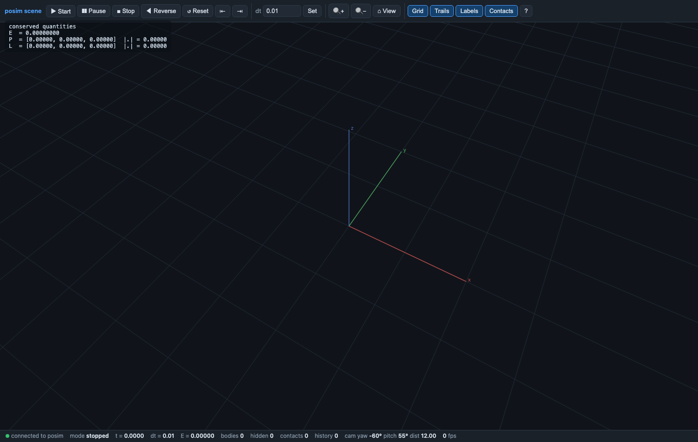

### `dynamic_two_dumbbells`

This notebook is one half of a pair. The other half is the example file dynamic_notebooks/two_dumbbells.posim in this repository, which contains the same simulation written directly in the simulator's own command language. This notebook runs that same simulation from Python, and explains every line of it.

- **Executed**: PASS — every cell green (8 code cells)
- **Copy**: `SolveIt_Notebooks_for_rust/03_dynamics_and_routh/dynamic_two_dumbbells/dynamic_two_dumbbells.ipynb` (header cell prepended: run commands, GUI commands, movies, data access, full player script)
- **Canonical source**: `rustSolveIt_macos-silicon_SUNDIALS_7_8_0/notebooks/dynamic_two_dumbbells.ipynb`
- **Paired scene/source**: `rustSolveIt_macos-silicon_SUNDIALS_7_8_0/dynamic_notebooks/two_dumbbells.posim`
- **Player**: `python3 SolveIt_Notebooks_for_rust/03_dynamics_and_routh/dynamic_two_dumbbells/player_dynamic_two_dumbbells.py run|gui|jump|capture out.png|data outdir`


### `dynamic_unequal_masses`

This notebook is one half of a pair. The other half is the example file dynamic_notebooks/unequal_masses.posim in this repository, which contains the same simulation written directly in the simulator's own command language. This notebook runs that same simulation from Python, and explains every line of it.

- **Executed**: PASS — every cell green (6 code cells)
- **Copy**: `SolveIt_Notebooks_for_rust/03_dynamics_and_routh/dynamic_unequal_masses/dynamic_unequal_masses.ipynb` (header cell prepended: run commands, GUI commands, movies, data access, full player script)
- **Canonical source**: `rustSolveIt_macos-silicon_SUNDIALS_7_8_0/notebooks/dynamic_unequal_masses.ipynb`
- **Paired scene/source**: `rustSolveIt_macos-silicon_SUNDIALS_7_8_0/dynamic_notebooks/unequal_masses.posim`
- **Player**: `python3 SolveIt_Notebooks_for_rust/03_dynamics_and_routh/dynamic_unequal_masses/player_dynamic_unequal_masses.py run|gui|jump|capture out.png|data outdir`


## 04_collisions

The collision-detection walkthroughs: elastic exchanges, restitution ladders, billiards, dumbbells, and the box-of-shapes stress test, all integrated by the pure-Rust engine.

### `collision_01_head_on_exchange`

This notebook is one half of a pair. The other half is the example file scripts/collisions/01_head_on_exchange.posim in this repository, which contains the same simulation written directly in the simulator's own command language. This notebook runs that same simulation from Python, and explains every line of it.

- **Executed**: PASS — every cell green (9 code cells)
- **Copy**: `SolveIt_Notebooks_for_rust/04_collisions/collision_01_head_on_exchange/collision_01_head_on_exchange.ipynb` (header cell prepended: run commands, GUI commands, movies, data access, full player script)
- **Canonical source**: `rustSolveIt_macos-silicon_SUNDIALS_7_8_0/notebooks/collision_01_head_on_exchange.ipynb`
- **Paired scene/source**: `rustSolveIt_macos-silicon_SUNDIALS_7_8_0/scripts/collisions/01_head_on_exchange.posim`
- **Player**: `python3 SolveIt_Notebooks_for_rust/04_collisions/collision_01_head_on_exchange/player_collision_01_head_on_exchange.py run|gui|jump|capture out.png|data outdir`

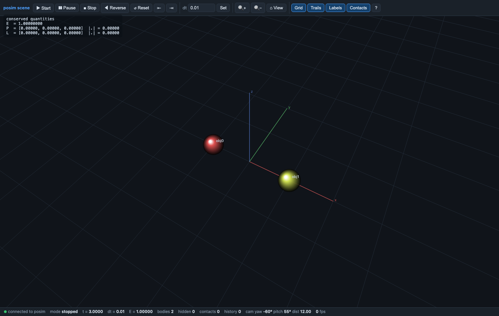

### `collision_02_unequal_masses`

This notebook is one half of a pair. The other half is the example file scripts/collisions/02_unequal_masses.posim in this repository, which contains the same simulation written directly in the simulator's own command language. This notebook runs that same simulation from Python, and explains every line of it.

- **Executed**: PASS — every cell green (6 code cells)
- **Copy**: `SolveIt_Notebooks_for_rust/04_collisions/collision_02_unequal_masses/collision_02_unequal_masses.ipynb` (header cell prepended: run commands, GUI commands, movies, data access, full player script)
- **Canonical source**: `rustSolveIt_macos-silicon_SUNDIALS_7_8_0/notebooks/collision_02_unequal_masses.ipynb`
- **Paired scene/source**: `rustSolveIt_macos-silicon_SUNDIALS_7_8_0/scripts/collisions/02_unequal_masses.posim`
- **Player**: `python3 SolveIt_Notebooks_for_rust/04_collisions/collision_02_unequal_masses/player_collision_02_unequal_masses.py run|gui|jump|capture out.png|data outdir`

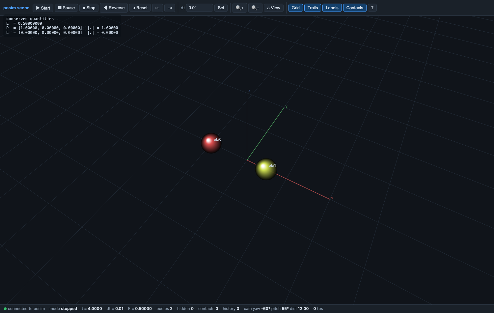

### `collision_03_restitution_ladder`

This notebook is one half of a pair. The other half is the example file scripts/collisions/03_restitution_ladder.posim in this repository, which contains the same simulation written directly in the simulator's own command language. This notebook runs that same simulation from Python, and explains every line of it.

- **Executed**: PASS — every cell green (18 code cells)
- **Copy**: `SolveIt_Notebooks_for_rust/04_collisions/collision_03_restitution_ladder/collision_03_restitution_ladder.ipynb` (header cell prepended: run commands, GUI commands, movies, data access, full player script)
- **Canonical source**: `rustSolveIt_macos-silicon_SUNDIALS_7_8_0/notebooks/collision_03_restitution_ladder.ipynb`
- **Paired scene/source**: `rustSolveIt_macos-silicon_SUNDIALS_7_8_0/scripts/collisions/03_restitution_ladder.posim`
- **Player**: `python3 SolveIt_Notebooks_for_rust/04_collisions/collision_03_restitution_ladder/player_collision_03_restitution_ladder.py run|gui|jump|capture out.png|data outdir`

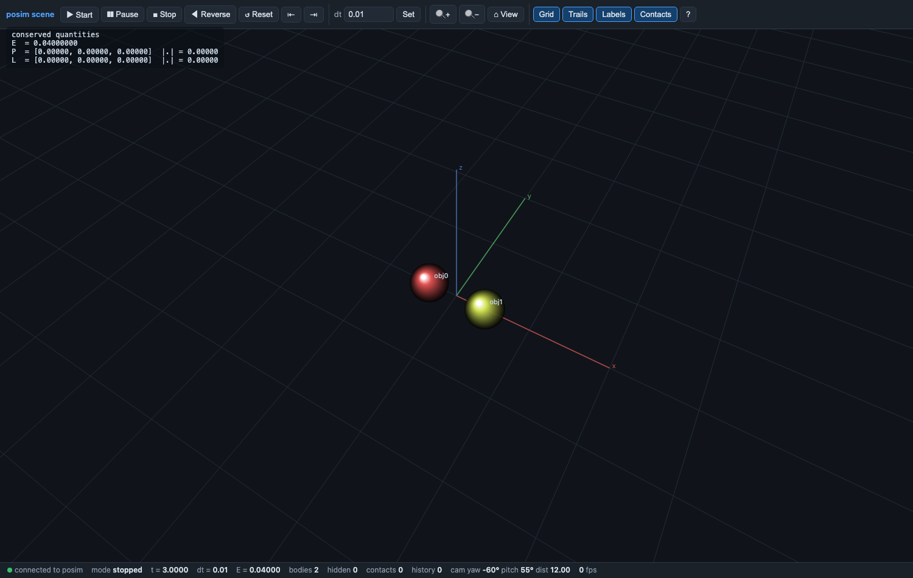

### `collision_04_newtons_cradle`

This notebook is one half of a pair. The other half is the example file scripts/collisions/04_newtons_cradle.posim in this repository, which contains the same simulation written directly in the simulator's own command language. This notebook runs that same simulation from Python, and explains every line of it.

- **Executed**: PASS — every cell green (8 code cells)
- **Copy**: `SolveIt_Notebooks_for_rust/04_collisions/collision_04_newtons_cradle/collision_04_newtons_cradle.ipynb` (header cell prepended: run commands, GUI commands, movies, data access, full player script)
- **Canonical source**: `rustSolveIt_macos-silicon_SUNDIALS_7_8_0/notebooks/collision_04_newtons_cradle.ipynb`
- **Paired scene/source**: `rustSolveIt_macos-silicon_SUNDIALS_7_8_0/scripts/collisions/04_newtons_cradle.posim`
- **Player**: `python3 SolveIt_Notebooks_for_rust/04_collisions/collision_04_newtons_cradle/player_collision_04_newtons_cradle.py run|gui|jump|capture out.png|data outdir`

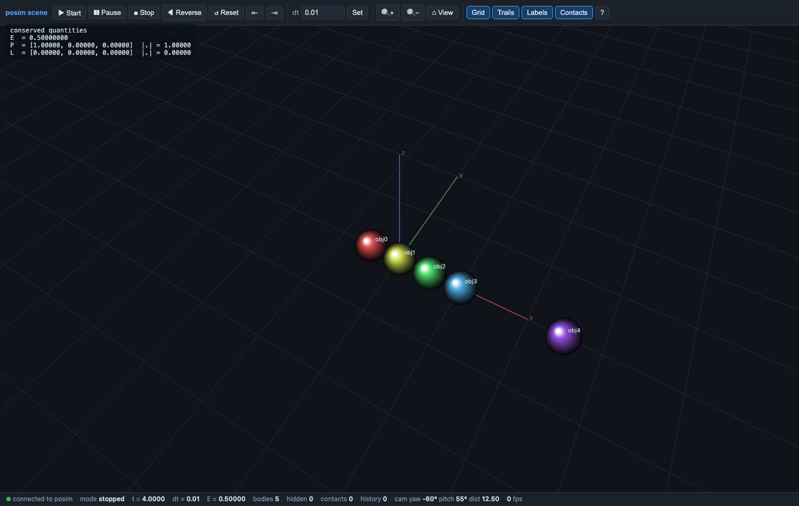

### `collision_05_billiard_break`

This notebook is one half of a pair. The other half is the example file scripts/collisions/05_billiard_break.posim in this repository, which contains the same simulation written directly in the simulator's own command language. This notebook runs that same simulation from Python, and explains every line of it.

- **Executed**: PASS — every cell green (8 code cells)
- **Copy**: `SolveIt_Notebooks_for_rust/04_collisions/collision_05_billiard_break/collision_05_billiard_break.ipynb` (header cell prepended: run commands, GUI commands, movies, data access, full player script)
- **Canonical source**: `rustSolveIt_macos-silicon_SUNDIALS_7_8_0/notebooks/collision_05_billiard_break.ipynb`
- **Paired scene/source**: `rustSolveIt_macos-silicon_SUNDIALS_7_8_0/scripts/collisions/05_billiard_break.posim`
- **Player**: `python3 SolveIt_Notebooks_for_rust/04_collisions/collision_05_billiard_break/player_collision_05_billiard_break.py run|gui|jump|capture out.png|data outdir`

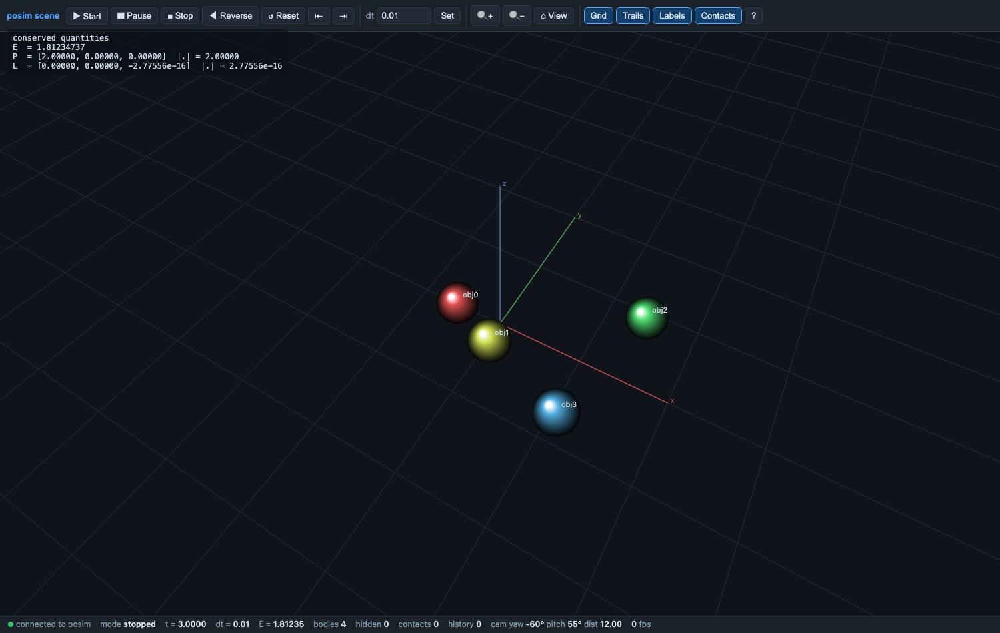

### `collision_06_spin_up`

This notebook is one half of a pair. The other half is the example file scripts/collisions/06_spin_up.posim in this repository, which contains the same simulation written directly in the simulator's own command language. This notebook runs that same simulation from Python, and explains every line of it.

- **Executed**: PASS — every cell green (8 code cells)
- **Copy**: `SolveIt_Notebooks_for_rust/04_collisions/collision_06_spin_up/collision_06_spin_up.ipynb` (header cell prepended: run commands, GUI commands, movies, data access, full player script)
- **Canonical source**: `rustSolveIt_macos-silicon_SUNDIALS_7_8_0/notebooks/collision_06_spin_up.ipynb`
- **Paired scene/source**: `rustSolveIt_macos-silicon_SUNDIALS_7_8_0/scripts/collisions/06_spin_up.posim`
- **Player**: `python3 SolveIt_Notebooks_for_rust/04_collisions/collision_06_spin_up/player_collision_06_spin_up.py run|gui|jump|capture out.png|data outdir`

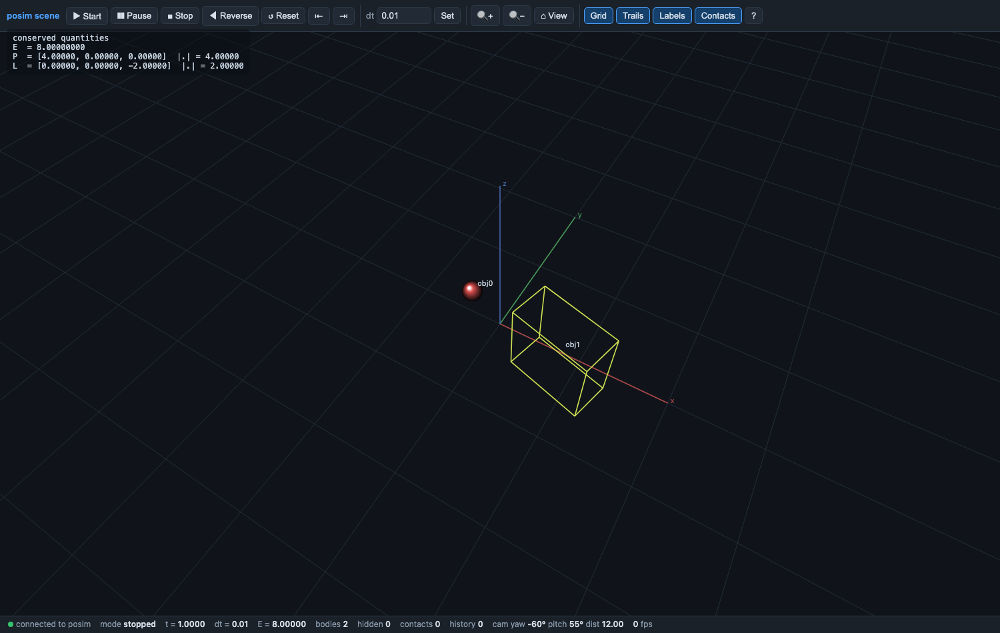

### `collision_07_thin_wall_toi`

This notebook is one half of a pair. The other half is the example file scripts/collisions/07_thin_wall_toi.posim in this repository, which contains the same simulation written directly in the simulator's own command language. This notebook runs that same simulation from Python, and explains every line of it.

- **Executed**: PASS — every cell green (6 code cells)
- **Copy**: `SolveIt_Notebooks_for_rust/04_collisions/collision_07_thin_wall_toi/collision_07_thin_wall_toi.ipynb` (header cell prepended: run commands, GUI commands, movies, data access, full player script)
- **Canonical source**: `rustSolveIt_macos-silicon_SUNDIALS_7_8_0/notebooks/collision_07_thin_wall_toi.ipynb`
- **Paired scene/source**: `rustSolveIt_macos-silicon_SUNDIALS_7_8_0/scripts/collisions/07_thin_wall_toi.posim`
- **Player**: `python3 SolveIt_Notebooks_for_rust/04_collisions/collision_07_thin_wall_toi/player_collision_07_thin_wall_toi.py run|gui|jump|capture out.png|data outdir`

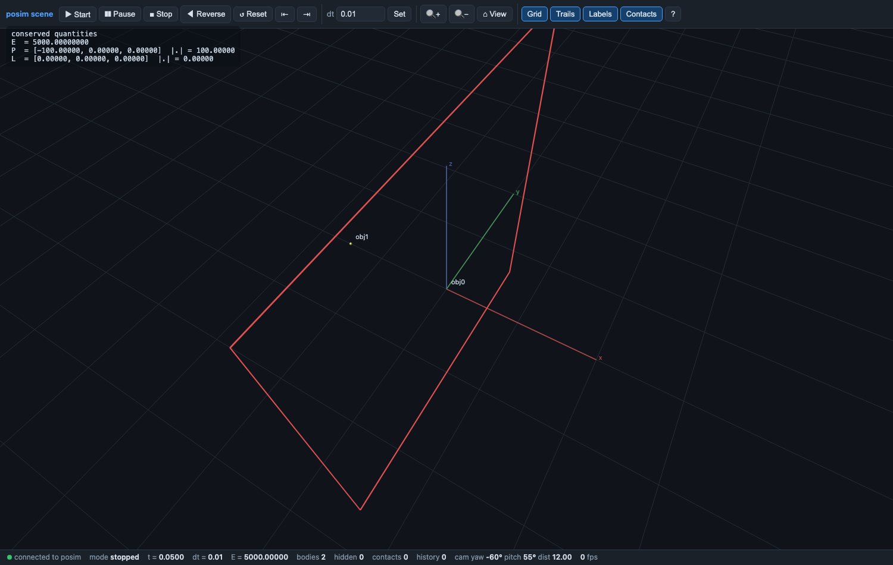

### `collision_08_colliding_binary`

This notebook is one half of a pair. The other half is the example file scripts/collisions/08_colliding_binary.posim in this repository, which contains the same simulation written directly in the simulator's own command language. This notebook runs that same simulation from Python, and explains every line of it.

- **Executed**: PASS — every cell green (8 code cells)
- **Copy**: `SolveIt_Notebooks_for_rust/04_collisions/collision_08_colliding_binary/collision_08_colliding_binary.ipynb` (header cell prepended: run commands, GUI commands, movies, data access, full player script)
- **Canonical source**: `rustSolveIt_macos-silicon_SUNDIALS_7_8_0/notebooks/collision_08_colliding_binary.ipynb`
- **Paired scene/source**: `rustSolveIt_macos-silicon_SUNDIALS_7_8_0/scripts/collisions/08_colliding_binary.posim`
- **Player**: `python3 SolveIt_Notebooks_for_rust/04_collisions/collision_08_colliding_binary/player_collision_08_colliding_binary.py run|gui|jump|capture out.png|data outdir`


### `collision_09_spinning_target`

This notebook is one half of a pair. The other half is the example file scripts/collisions/09_spinning_target.posim in this repository, which contains the same simulation written directly in the simulator's own command language. This notebook runs that same simulation from Python, and explains every line of it.

- **Executed**: PASS — every cell green (8 code cells)
- **Copy**: `SolveIt_Notebooks_for_rust/04_collisions/collision_09_spinning_target/collision_09_spinning_target.ipynb` (header cell prepended: run commands, GUI commands, movies, data access, full player script)
- **Canonical source**: `rustSolveIt_macos-silicon_SUNDIALS_7_8_0/notebooks/collision_09_spinning_target.ipynb`
- **Paired scene/source**: `rustSolveIt_macos-silicon_SUNDIALS_7_8_0/scripts/collisions/09_spinning_target.posim`
- **Player**: `python3 SolveIt_Notebooks_for_rust/04_collisions/collision_09_spinning_target/player_collision_09_spinning_target.py run|gui|jump|capture out.png|data outdir`

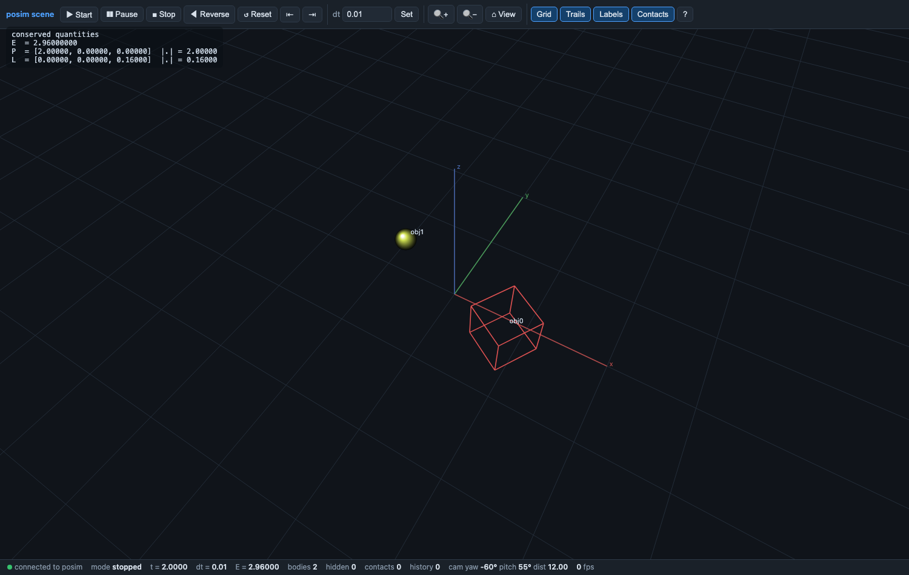

### `collision_10_billiard_box`

This notebook is one half of a pair. The other half is the example file scripts/collisions/10_billiard_box.posim in this repository, which contains the same simulation written directly in the simulator's own command language. This notebook runs that same simulation from Python, and explains every line of it.

- **Executed**: PASS — every cell green (8 code cells)
- **Copy**: `SolveIt_Notebooks_for_rust/04_collisions/collision_10_billiard_box/collision_10_billiard_box.ipynb` (header cell prepended: run commands, GUI commands, movies, data access, full player script)
- **Canonical source**: `rustSolveIt_macos-silicon_SUNDIALS_7_8_0/notebooks/collision_10_billiard_box.ipynb`
- **Paired scene/source**: `rustSolveIt_macos-silicon_SUNDIALS_7_8_0/scripts/collisions/10_billiard_box.posim`
- **Player**: `python3 SolveIt_Notebooks_for_rust/04_collisions/collision_10_billiard_box/player_collision_10_billiard_box.py run|gui|jump|capture out.png|data outdir`

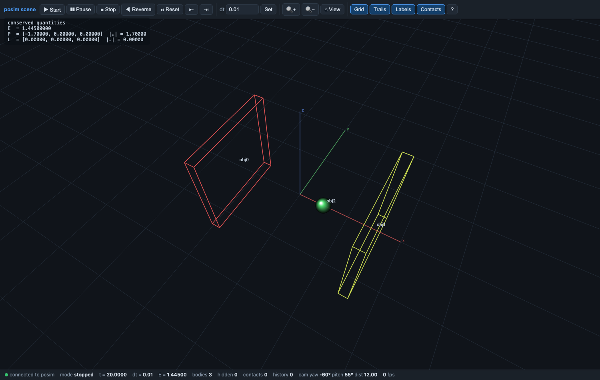

### `collision_11_box_of_shapes`

This notebook is one half of a pair. The other half is the example file scripts/collisions/11_box_of_shapes.posim in this repository, which contains the same simulation written directly in the simulator's own command language. This notebook runs that same simulation from Python, and explains every line of it.

- **Executed**: PASS — every cell green (10 code cells)
- **Copy**: `SolveIt_Notebooks_for_rust/04_collisions/collision_11_box_of_shapes/collision_11_box_of_shapes.ipynb` (header cell prepended: run commands, GUI commands, movies, data access, full player script)
- **Canonical source**: `rustSolveIt_macos-silicon_SUNDIALS_7_8_0/notebooks/collision_11_box_of_shapes.ipynb`
- **Paired scene/source**: `rustSolveIt_macos-silicon_SUNDIALS_7_8_0/scripts/collisions/11_box_of_shapes.posim`
- **Player**: `python3 SolveIt_Notebooks_for_rust/04_collisions/collision_11_box_of_shapes/player_collision_11_box_of_shapes.py run|gui|jump|capture out.png|data outdir`

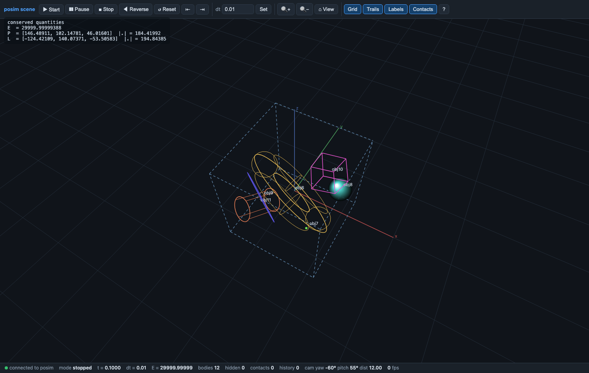

### `collision_12_two_dumbbells`

This notebook is one half of a pair. The other half is the example file scripts/collisions/12_two_dumbbells.posim in this repository, which contains the same simulation written directly in the simulator's own command language. This notebook runs that same simulation from Python, and explains every line of it.

- **Executed**: PASS — every cell green (9 code cells)
- **Copy**: `SolveIt_Notebooks_for_rust/04_collisions/collision_12_two_dumbbells/collision_12_two_dumbbells.ipynb` (header cell prepended: run commands, GUI commands, movies, data access, full player script)
- **Canonical source**: `rustSolveIt_macos-silicon_SUNDIALS_7_8_0/notebooks/collision_12_two_dumbbells.ipynb`
- **Paired scene/source**: `rustSolveIt_macos-silicon_SUNDIALS_7_8_0/scripts/collisions/12_two_dumbbells.posim`
- **Player**: `python3 SolveIt_Notebooks_for_rust/04_collisions/collision_12_two_dumbbells/player_collision_12_two_dumbbells.py run|gui|jump|capture out.png|data outdir`

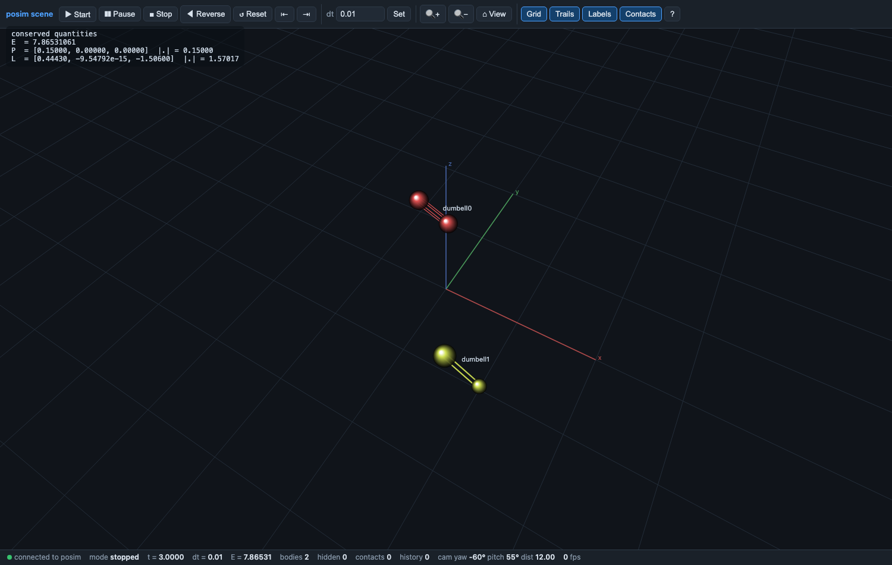

## 05_mechanism_videos

The thirteen recorded mechanism scenes: each notebook pairs with a recorded browser movie page in videos/ AND a live GUI server in gui/ that integrates the same scene in real time behind canvas controls with live physics readouts.

### `video_ball_joint_chain`

This notebook is one half of a pair. The other half is the example file videos/scenes/ball_joint_chain.posim in this repository, which contains the same simulation written directly in the simulator's own command language. This notebook runs that same simulation from Python, and explains every line of it.

- **Executed**: PASS — every cell green (7 code cells)
- **Copy**: `SolveIt_Notebooks_for_rust/05_mechanism_videos/video_ball_joint_chain/video_ball_joint_chain.ipynb` (header cell prepended: run commands, GUI commands, movies, data access, full player script)
- **Canonical source**: `rustSolveIt_macos-silicon_SUNDIALS_7_8_0/notebooks/video_ball_joint_chain.ipynb`
- **Paired scene/source**: `rustSolveIt_macos-silicon_SUNDIALS_7_8_0/videos/scenes/ball_joint_chain.posim`
- **Movie page**: `rustSolveIt_macos-silicon_SUNDIALS_7_8_0/videos/ball_joint_chain.html`
- **Live GUI**: `python3 rustSolveIt_macos-silicon_SUNDIALS_7_8_0/gui/ball_joint_chain/server.py`
- **Player**: `python3 SolveIt_Notebooks_for_rust/05_mechanism_videos/video_ball_joint_chain/player_video_ball_joint_chain.py run|gui|jump|capture out.png|data outdir`

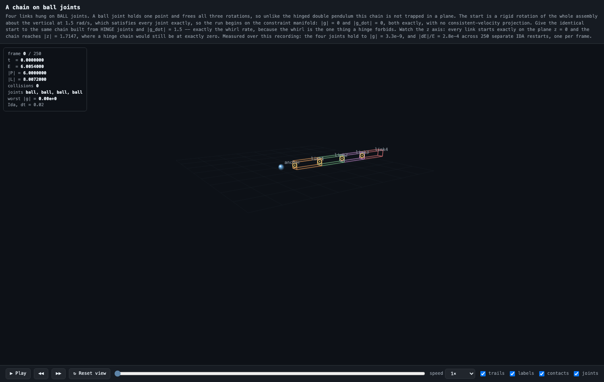

### `video_box_of_shapes`

This notebook is one half of a pair. The other half is the example file videos/scenes/box_of_shapes.posim in this repository, which contains the same simulation written directly in the simulator's own command language. This notebook runs that same simulation from Python, and explains every line of it.

- **Executed**: PASS — every cell green (5 code cells)
- **Copy**: `SolveIt_Notebooks_for_rust/05_mechanism_videos/video_box_of_shapes/video_box_of_shapes.ipynb` (header cell prepended: run commands, GUI commands, movies, data access, full player script)
- **Canonical source**: `rustSolveIt_macos-silicon_SUNDIALS_7_8_0/notebooks/video_box_of_shapes.ipynb`
- **Paired scene/source**: `rustSolveIt_macos-silicon_SUNDIALS_7_8_0/videos/scenes/box_of_shapes.posim`
- **Movie page**: `rustSolveIt_macos-silicon_SUNDIALS_7_8_0/videos/box_of_shapes.html`
- **Live GUI**: `python3 rustSolveIt_macos-silicon_SUNDIALS_7_8_0/gui/box_of_shapes/server.py`
- **Player**: `python3 SolveIt_Notebooks_for_rust/05_mechanism_videos/video_box_of_shapes/player_video_box_of_shapes.py run|gui|jump|capture out.png|data outdir`

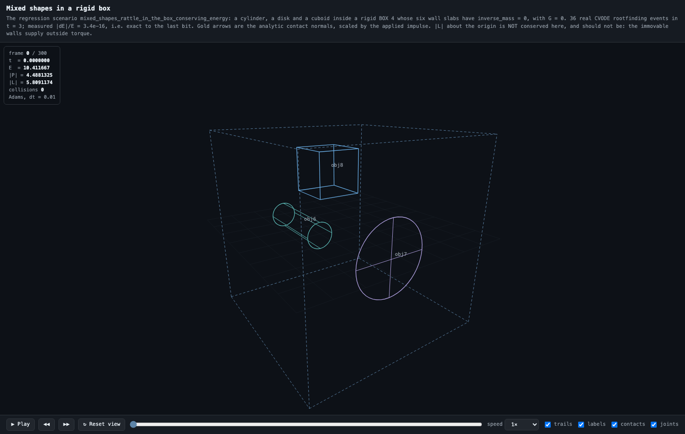

### `video_cardan_compass`

This notebook is one half of a pair. The other half is the example file videos/scenes/cardan_compass.posim in this repository, which contains the same simulation written directly in the simulator's own command language. This notebook runs that same simulation from Python, and explains every line of it.

- **Executed**: PASS — every cell green (8 code cells)
- **Copy**: `SolveIt_Notebooks_for_rust/05_mechanism_videos/video_cardan_compass/video_cardan_compass.ipynb` (header cell prepended: run commands, GUI commands, movies, data access, full player script)
- **Canonical source**: `rustSolveIt_macos-silicon_SUNDIALS_7_8_0/notebooks/video_cardan_compass.ipynb`
- **Paired scene/source**: `rustSolveIt_macos-silicon_SUNDIALS_7_8_0/videos/scenes/cardan_compass.posim`
- **Movie page**: `rustSolveIt_macos-silicon_SUNDIALS_7_8_0/videos/cardan_compass.html`
- **Live GUI**: `python3 rustSolveIt_macos-silicon_SUNDIALS_7_8_0/gui/cardan_compass/server.py`
- **Player**: `python3 SolveIt_Notebooks_for_rust/05_mechanism_videos/video_cardan_compass/player_video_cardan_compass.py run|gui|jump|capture out.png|data outdir`

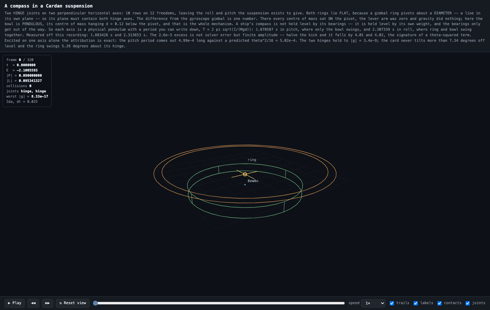

### `video_cardan_gear`

This notebook is one half of a pair. The other half is the example file videos/scenes/cardan_gear.posim in this repository, which contains the same simulation written directly in the simulator's own command language. This notebook runs that same simulation from Python, and explains every line of it.

- **Executed**: PASS — every cell green (10 code cells)
- **Copy**: `SolveIt_Notebooks_for_rust/05_mechanism_videos/video_cardan_gear/video_cardan_gear.ipynb` (header cell prepended: run commands, GUI commands, movies, data access, full player script)
- **Canonical source**: `rustSolveIt_macos-silicon_SUNDIALS_7_8_0/notebooks/video_cardan_gear.ipynb`
- **Paired scene/source**: `rustSolveIt_macos-silicon_SUNDIALS_7_8_0/videos/scenes/cardan_gear.posim`
- **Movie page**: `rustSolveIt_macos-silicon_SUNDIALS_7_8_0/videos/cardan_gear.html`
- **Live GUI**: `python3 rustSolveIt_macos-silicon_SUNDIALS_7_8_0/gui/cardan_gear/server.py`
- **Player**: `python3 SolveIt_Notebooks_for_rust/05_mechanism_videos/video_cardan_gear/player_video_cardan_gear.py run|gui|jump|capture out.png|data outdir`

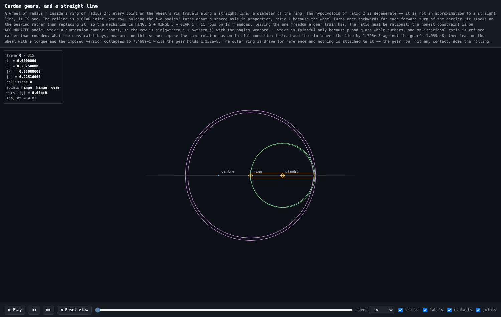

### `video_double_pendulum_hinges`

This notebook is one half of a pair. The other half is the example file videos/scenes/double_pendulum_hinges.posim in this repository, which contains the same simulation written directly in the simulator's own command language. This notebook runs that same simulation from Python, and explains every line of it.

- **Executed**: PASS — every cell green (6 code cells)
- **Copy**: `SolveIt_Notebooks_for_rust/05_mechanism_videos/video_double_pendulum_hinges/video_double_pendulum_hinges.ipynb` (header cell prepended: run commands, GUI commands, movies, data access, full player script)
- **Canonical source**: `rustSolveIt_macos-silicon_SUNDIALS_7_8_0/notebooks/video_double_pendulum_hinges.ipynb`
- **Paired scene/source**: `rustSolveIt_macos-silicon_SUNDIALS_7_8_0/videos/scenes/double_pendulum_hinges.posim`
- **Movie page**: `rustSolveIt_macos-silicon_SUNDIALS_7_8_0/videos/double_pendulum_hinges.html`
- **Live GUI**: `python3 rustSolveIt_macos-silicon_SUNDIALS_7_8_0/gui/double_pendulum_hinges/server.py`
- **Player**: `python3 SolveIt_Notebooks_for_rust/05_mechanism_videos/video_double_pendulum_hinges/player_video_double_pendulum_hinges.py run|gui|jump|capture out.png|data outdir`

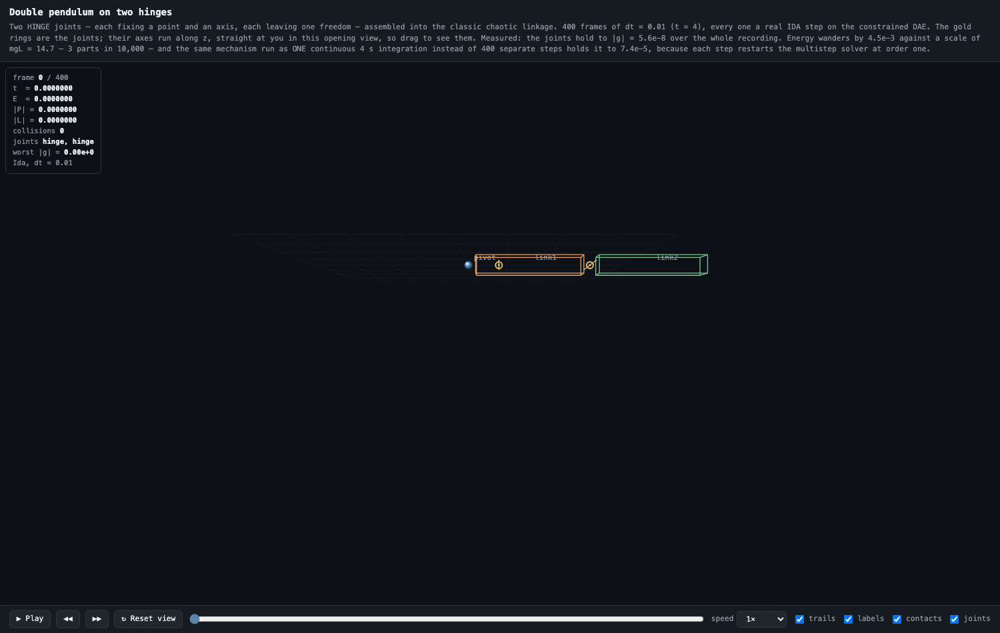

### `video_gyroscope_gimbal`

This notebook is one half of a pair. The other half is the example file videos/scenes/gyroscope_gimbal.posim in this repository, which contains the same simulation written directly in the simulator's own command language. This notebook runs that same simulation from Python, and explains every line of it.

- **Executed**: PASS — every cell green (8 code cells)
- **Copy**: `SolveIt_Notebooks_for_rust/05_mechanism_videos/video_gyroscope_gimbal/video_gyroscope_gimbal.ipynb` (header cell prepended: run commands, GUI commands, movies, data access, full player script)
- **Canonical source**: `rustSolveIt_macos-silicon_SUNDIALS_7_8_0/notebooks/video_gyroscope_gimbal.ipynb`
- **Paired scene/source**: `rustSolveIt_macos-silicon_SUNDIALS_7_8_0/videos/scenes/gyroscope_gimbal.posim`
- **Movie page**: `rustSolveIt_macos-silicon_SUNDIALS_7_8_0/videos/gyroscope_gimbal.html`
- **Live GUI**: `python3 rustSolveIt_macos-silicon_SUNDIALS_7_8_0/gui/gyroscope_gimbal/server.py`
- **Player**: `python3 SolveIt_Notebooks_for_rust/05_mechanism_videos/video_gyroscope_gimbal/player_video_gyroscope_gimbal.py run|gui|jump|capture out.png|data outdir`

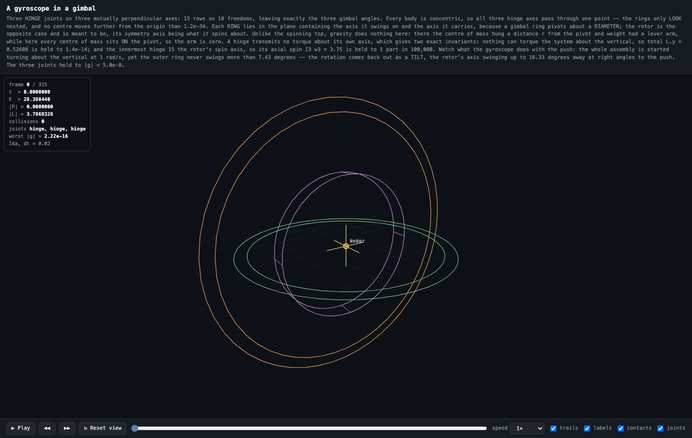

### `video_kepler_ellipse`

This notebook is one half of a pair. The other half is the example file videos/scenes/kepler_ellipse.posim in this repository, which contains the same simulation written directly in the simulator's own command language. This notebook runs that same simulation from Python, and explains every line of it.

- **Executed**: PASS — every cell green (5 code cells)
- **Copy**: `SolveIt_Notebooks_for_rust/05_mechanism_videos/video_kepler_ellipse/video_kepler_ellipse.ipynb` (header cell prepended: run commands, GUI commands, movies, data access, full player script)
- **Canonical source**: `rustSolveIt_macos-silicon_SUNDIALS_7_8_0/notebooks/video_kepler_ellipse.ipynb`
- **Paired scene/source**: `rustSolveIt_macos-silicon_SUNDIALS_7_8_0/videos/scenes/kepler_ellipse.posim`
- **Movie page**: `rustSolveIt_macos-silicon_SUNDIALS_7_8_0/videos/kepler_ellipse.html`
- **Live GUI**: `python3 rustSolveIt_macos-silicon_SUNDIALS_7_8_0/gui/kepler_ellipse/server.py`
- **Player**: `python3 SolveIt_Notebooks_for_rust/05_mechanism_videos/video_kepler_ellipse/player_video_kepler_ellipse.py run|gui|jump|capture out.png|data outdir`

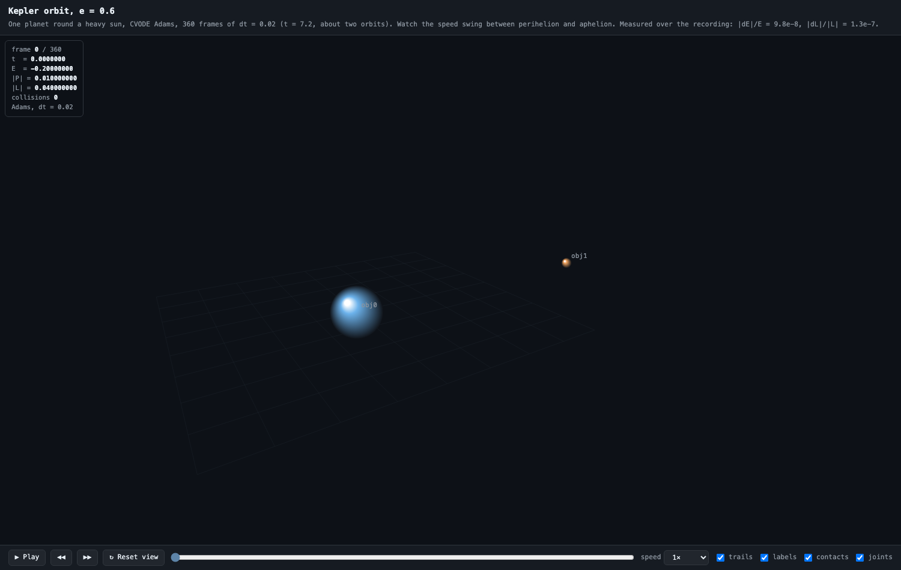

### `video_piston_crankshaft`

This notebook is one half of a pair. The other half is the example file videos/scenes/piston_crankshaft.posim in this repository, which contains the same simulation written directly in the simulator's own command language. This notebook runs that same simulation from Python, and explains every line of it.

- **Executed**: PASS — every cell green (10 code cells)
- **Copy**: `SolveIt_Notebooks_for_rust/05_mechanism_videos/video_piston_crankshaft/video_piston_crankshaft.ipynb` (header cell prepended: run commands, GUI commands, movies, data access, full player script)
- **Canonical source**: `rustSolveIt_macos-silicon_SUNDIALS_7_8_0/notebooks/video_piston_crankshaft.ipynb`
- **Paired scene/source**: `rustSolveIt_macos-silicon_SUNDIALS_7_8_0/videos/scenes/piston_crankshaft.posim`
- **Movie page**: `rustSolveIt_macos-silicon_SUNDIALS_7_8_0/videos/piston_crankshaft.html`
- **Live GUI**: `python3 rustSolveIt_macos-silicon_SUNDIALS_7_8_0/gui/piston_crankshaft/server.py`
- **Player**: `python3 SolveIt_Notebooks_for_rust/05_mechanism_videos/video_piston_crankshaft/player_video_piston_crankshaft.py run|gui|jump|capture out.png|data outdir`

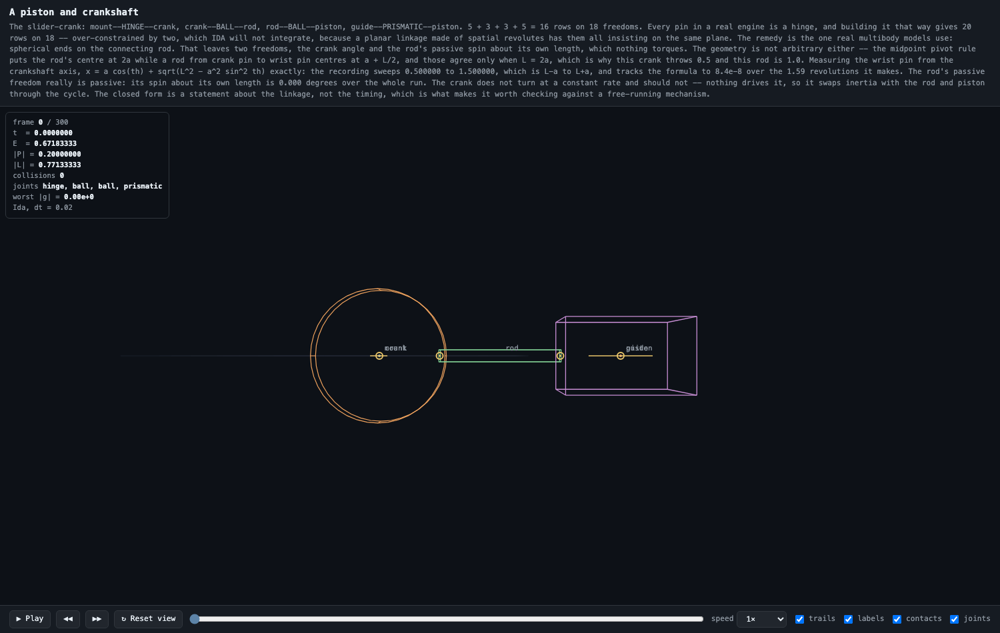

### `video_rack_and_pinion`

This notebook is one half of a pair. The other half is the example file videos/scenes/rack_and_pinion.posim in this repository, which contains the same simulation written directly in the simulator's own command language. This notebook runs that same simulation from Python, and explains every line of it.

- **Executed**: PASS — every cell green (8 code cells)
- **Copy**: `SolveIt_Notebooks_for_rust/05_mechanism_videos/video_rack_and_pinion/video_rack_and_pinion.ipynb` (header cell prepended: run commands, GUI commands, movies, data access, full player script)
- **Canonical source**: `rustSolveIt_macos-silicon_SUNDIALS_7_8_0/notebooks/video_rack_and_pinion.ipynb`
- **Paired scene/source**: `rustSolveIt_macos-silicon_SUNDIALS_7_8_0/videos/scenes/rack_and_pinion.posim`
- **Movie page**: `rustSolveIt_macos-silicon_SUNDIALS_7_8_0/videos/rack_and_pinion.html`
- **Live GUI**: `python3 rustSolveIt_macos-silicon_SUNDIALS_7_8_0/gui/rack_and_pinion/server.py`
- **Player**: `python3 SolveIt_Notebooks_for_rust/05_mechanism_videos/video_rack_and_pinion/player_video_rack_and_pinion.py run|gui|jump|capture out.png|data outdir`

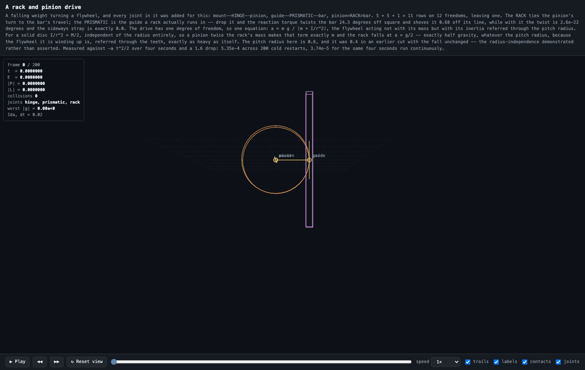

### `video_rod_pendulum_chain`

This notebook is one half of a pair. The other half is the example file videos/scenes/rod_pendulum_chain.posim in this repository, which contains the same simulation written directly in the simulator's own command language. This notebook runs that same simulation from Python, and explains every line of it.

- **Executed**: PASS — every cell green (8 code cells)
- **Copy**: `SolveIt_Notebooks_for_rust/05_mechanism_videos/video_rod_pendulum_chain/video_rod_pendulum_chain.ipynb` (header cell prepended: run commands, GUI commands, movies, data access, full player script)
- **Canonical source**: `rustSolveIt_macos-silicon_SUNDIALS_7_8_0/notebooks/video_rod_pendulum_chain.ipynb`
- **Paired scene/source**: `rustSolveIt_macos-silicon_SUNDIALS_7_8_0/videos/scenes/rod_pendulum_chain.posim`
- **Movie page**: `rustSolveIt_macos-silicon_SUNDIALS_7_8_0/videos/rod_pendulum_chain.html`
- **Live GUI**: `python3 rustSolveIt_macos-silicon_SUNDIALS_7_8_0/gui/rod_pendulum_chain/server.py`
- **Player**: `python3 SolveIt_Notebooks_for_rust/05_mechanism_videos/video_rod_pendulum_chain/player_video_rod_pendulum_chain.py run|gui|jump|capture out.png|data outdir`

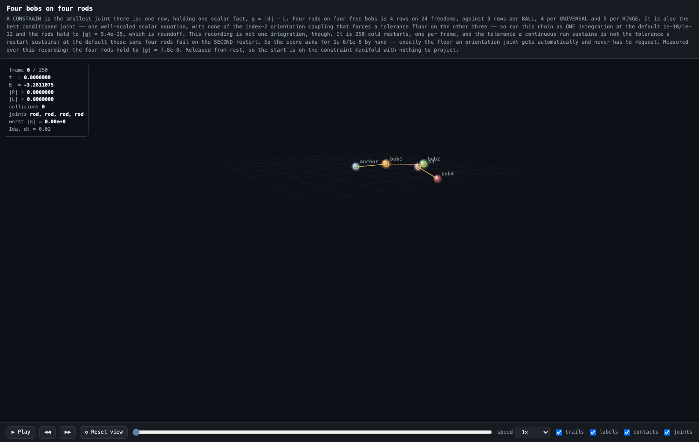

### `video_spinning_top`

This notebook is one half of a pair. The other half is the example file videos/scenes/spinning_top.posim in this repository, which contains the same simulation written directly in the simulator's own command language. This notebook runs that same simulation from Python, and explains every line of it.

- **Executed**: PASS — every cell green (8 code cells)
- **Copy**: `SolveIt_Notebooks_for_rust/05_mechanism_videos/video_spinning_top/video_spinning_top.ipynb` (header cell prepended: run commands, GUI commands, movies, data access, full player script)
- **Canonical source**: `rustSolveIt_macos-silicon_SUNDIALS_7_8_0/notebooks/video_spinning_top.ipynb`
- **Paired scene/source**: `rustSolveIt_macos-silicon_SUNDIALS_7_8_0/videos/scenes/spinning_top.posim`
- **Movie page**: `rustSolveIt_macos-silicon_SUNDIALS_7_8_0/videos/spinning_top.html`
- **Live GUI**: `python3 rustSolveIt_macos-silicon_SUNDIALS_7_8_0/gui/spinning_top/server.py`
- **Player**: `python3 SolveIt_Notebooks_for_rust/05_mechanism_videos/video_spinning_top/player_video_spinning_top.py run|gui|jump|capture out.png|data outdir`

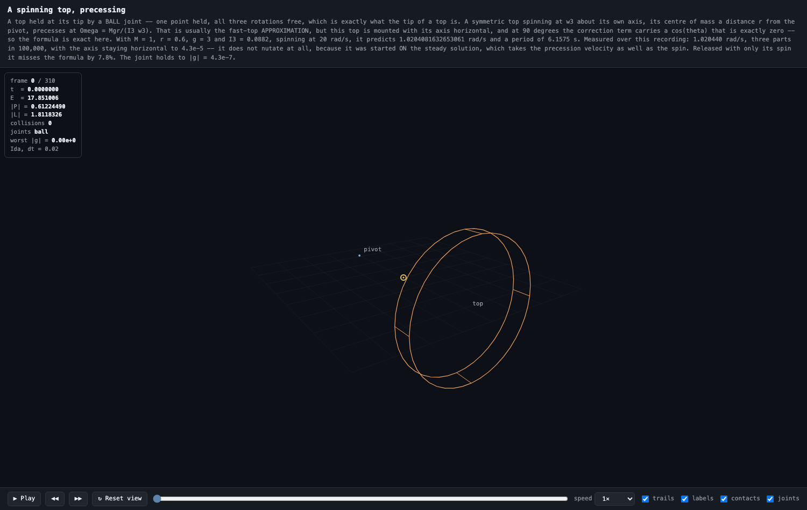

### `video_tumbling_racket`

This notebook is one half of a pair. The other half is the example file videos/scenes/tumbling_racket.posim in this repository, which contains the same simulation written directly in the simulator's own command language. This notebook runs that same simulation from Python, and explains every line of it.

- **Executed**: PASS — every cell green (4 code cells)
- **Copy**: `SolveIt_Notebooks_for_rust/05_mechanism_videos/video_tumbling_racket/video_tumbling_racket.ipynb` (header cell prepended: run commands, GUI commands, movies, data access, full player script)
- **Canonical source**: `rustSolveIt_macos-silicon_SUNDIALS_7_8_0/notebooks/video_tumbling_racket.ipynb`
- **Paired scene/source**: `rustSolveIt_macos-silicon_SUNDIALS_7_8_0/videos/scenes/tumbling_racket.posim`
- **Movie page**: `rustSolveIt_macos-silicon_SUNDIALS_7_8_0/videos/tumbling_racket.html`
- **Live GUI**: `python3 rustSolveIt_macos-silicon_SUNDIALS_7_8_0/gui/tumbling_racket/server.py`
- **Player**: `python3 SolveIt_Notebooks_for_rust/05_mechanism_videos/video_tumbling_racket/player_video_tumbling_racket.py run|gui|jump|capture out.png|data outdir`

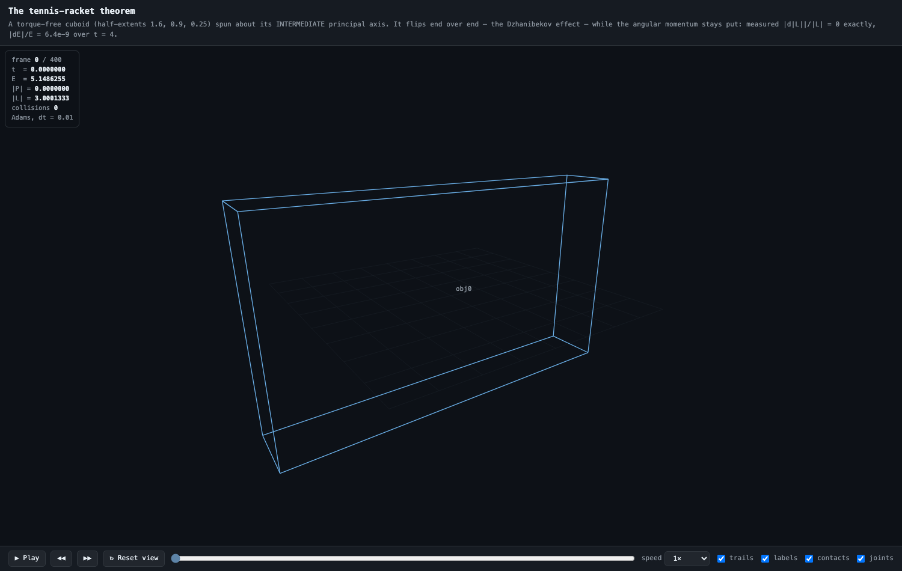

### `video_universal_joint`

This notebook is one half of a pair. The other half is the example file videos/scenes/universal_joint.posim in this repository, which contains the same simulation written directly in the simulator's own command language. This notebook runs that same simulation from Python, and explains every line of it.

- **Executed**: PASS — every cell green (8 code cells)
- **Copy**: `SolveIt_Notebooks_for_rust/05_mechanism_videos/video_universal_joint/video_universal_joint.ipynb` (header cell prepended: run commands, GUI commands, movies, data access, full player script)
- **Canonical source**: `rustSolveIt_macos-silicon_SUNDIALS_7_8_0/notebooks/video_universal_joint.ipynb`
- **Paired scene/source**: `rustSolveIt_macos-silicon_SUNDIALS_7_8_0/videos/scenes/universal_joint.posim`
- **Movie page**: `rustSolveIt_macos-silicon_SUNDIALS_7_8_0/videos/universal_joint.html`
- **Live GUI**: `python3 rustSolveIt_macos-silicon_SUNDIALS_7_8_0/gui/universal_joint/server.py`
- **Player**: `python3 SolveIt_Notebooks_for_rust/05_mechanism_videos/video_universal_joint/player_video_universal_joint.py run|gui|jump|capture out.png|data outdir`

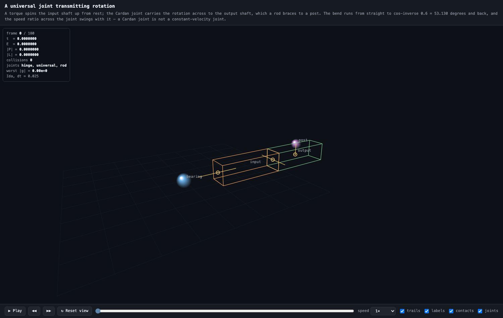

## 06_rust_compiled_examples

The compiled, self-checking Rust examples: each notebook builds and runs one physical_object example and asserts its SUCCESS verdict — the verdict is textual, so these entries carry no GUI image, honestly.

### `rust_bouncing_ball_restitution`

This notebook is one half of a pair. The other half is the example file physical_object/examples/bouncing_ball_restitution.rs in this repository, which contains the same simulation written directly in the simulator's own command language. This notebook runs that same simulation from Python, and explains every line of it.

- **Executed**: PASS — every cell green (8 code cells)
- **Copy**: `SolveIt_Notebooks_for_rust/06_rust_compiled_examples/rust_bouncing_ball_restitution/rust_bouncing_ball_restitution.ipynb` (header cell prepended: run commands, GUI commands, movies, data access, full player script)
- **Canonical source**: `rustSolveIt_macos-silicon_SUNDIALS_7_8_0/notebooks/rust_bouncing_ball_restitution.ipynb`
- **Paired scene/source**: `rustSolveIt_macos-silicon_SUNDIALS_7_8_0/physical_object/examples/bouncing_ball_restitution.rs`
- **Player**: `python3 SolveIt_Notebooks_for_rust/06_rust_compiled_examples/rust_bouncing_ball_restitution/player_rust_bouncing_ball_restitution.py run|gui|jump|capture out.png|data outdir`

*(no browser GUI in this family — the verdict is textual, embedded in the executed notebook)*

### `rust_charged_in_b_field`

This notebook is one half of a pair. The other half is the example file physical_object/examples/charged_in_b_field.rs in this repository, which contains the same simulation written directly in the simulator's own command language. This notebook runs that same simulation from Python, and explains every line of it.

- **Executed**: PASS — every cell green (10 code cells)
- **Copy**: `SolveIt_Notebooks_for_rust/06_rust_compiled_examples/rust_charged_in_b_field/rust_charged_in_b_field.ipynb` (header cell prepended: run commands, GUI commands, movies, data access, full player script)
- **Canonical source**: `rustSolveIt_macos-silicon_SUNDIALS_7_8_0/notebooks/rust_charged_in_b_field.ipynb`
- **Paired scene/source**: `rustSolveIt_macos-silicon_SUNDIALS_7_8_0/physical_object/examples/charged_in_b_field.rs`
- **Player**: `python3 SolveIt_Notebooks_for_rust/06_rust_compiled_examples/rust_charged_in_b_field/player_rust_charged_in_b_field.py run|gui|jump|capture out.png|data outdir`

*(no browser GUI in this family — the verdict is textual, embedded in the executed notebook)*

### `rust_kepler_orbit`

This notebook is one half of a pair. The other half is the example file physical_object/examples/kepler_orbit.rs in this repository, which contains the same simulation written directly in the simulator's own command language. This notebook runs that same simulation from Python, and explains every line of it.

- **Executed**: PASS — every cell green (10 code cells)
- **Copy**: `SolveIt_Notebooks_for_rust/06_rust_compiled_examples/rust_kepler_orbit/rust_kepler_orbit.ipynb` (header cell prepended: run commands, GUI commands, movies, data access, full player script)
- **Canonical source**: `rustSolveIt_macos-silicon_SUNDIALS_7_8_0/notebooks/rust_kepler_orbit.ipynb`
- **Paired scene/source**: `rustSolveIt_macos-silicon_SUNDIALS_7_8_0/physical_object/examples/kepler_orbit.rs`
- **Player**: `python3 SolveIt_Notebooks_for_rust/06_rust_compiled_examples/rust_kepler_orbit/player_rust_kepler_orbit.py run|gui|jump|capture out.png|data outdir`

*(no browser GUI in this family — the verdict is textual, embedded in the executed notebook)*

### `rust_newtons_cradle`

This notebook is one half of a pair. The other half is the example file physical_object/examples/newtons_cradle.rs in this repository, which contains the same simulation written directly in the simulator's own command language. This notebook runs that same simulation from Python, and explains every line of it.

- **Executed**: PASS — every cell green (11 code cells)
- **Copy**: `SolveIt_Notebooks_for_rust/06_rust_compiled_examples/rust_newtons_cradle/rust_newtons_cradle.ipynb` (header cell prepended: run commands, GUI commands, movies, data access, full player script)
- **Canonical source**: `rustSolveIt_macos-silicon_SUNDIALS_7_8_0/notebooks/rust_newtons_cradle.ipynb`
- **Paired scene/source**: `rustSolveIt_macos-silicon_SUNDIALS_7_8_0/physical_object/examples/newtons_cradle.rs`
- **Player**: `python3 SolveIt_Notebooks_for_rust/06_rust_compiled_examples/rust_newtons_cradle/player_rust_newtons_cradle.py run|gui|jump|capture out.png|data outdir`

*(no browser GUI in this family — the verdict is textual, embedded in the executed notebook)*

### `rust_outer_solar_system`

This notebook is one half of a pair. The other half is the example file physical_object/examples/outer_solar_system.rs in this repository, which contains the same simulation written directly in the simulator's own command language. This notebook runs that same simulation from Python, and explains every line of it.

- **Executed**: PASS — every cell green (11 code cells)
- **Copy**: `SolveIt_Notebooks_for_rust/06_rust_compiled_examples/rust_outer_solar_system/rust_outer_solar_system.ipynb` (header cell prepended: run commands, GUI commands, movies, data access, full player script)
- **Canonical source**: `rustSolveIt_macos-silicon_SUNDIALS_7_8_0/notebooks/rust_outer_solar_system.ipynb`
- **Paired scene/source**: `rustSolveIt_macos-silicon_SUNDIALS_7_8_0/physical_object/examples/outer_solar_system.rs`
- **Player**: `python3 SolveIt_Notebooks_for_rust/06_rust_compiled_examples/rust_outer_solar_system/player_rust_outer_solar_system.py run|gui|jump|capture out.png|data outdir`

*(no browser GUI in this family — the verdict is textual, embedded in the executed notebook)*

### `rust_tumbling_body`

This notebook is one half of a pair. The other half is the example file physical_object/examples/tumbling_body.rs in this repository, which contains the same simulation written directly in the simulator's own command language. This notebook runs that same simulation from Python, and explains every line of it.

- **Executed**: PASS — every cell green (9 code cells)
- **Copy**: `SolveIt_Notebooks_for_rust/06_rust_compiled_examples/rust_tumbling_body/rust_tumbling_body.ipynb` (header cell prepended: run commands, GUI commands, movies, data access, full player script)
- **Canonical source**: `rustSolveIt_macos-silicon_SUNDIALS_7_8_0/notebooks/rust_tumbling_body.ipynb`
- **Paired scene/source**: `rustSolveIt_macos-silicon_SUNDIALS_7_8_0/physical_object/examples/tumbling_body.rs`
- **Player**: `python3 SolveIt_Notebooks_for_rust/06_rust_compiled_examples/rust_tumbling_body/player_rust_tumbling_body.py run|gui|jump|capture out.png|data outdir`

*(no browser GUI in this family — the verdict is textual, embedded in the executed notebook)*

## 07_nbody_rebound_rust

The N-body verification notebooks of the rebound/reboundx pure-Rust port: integrator equivalence, simulation archives, tides and spin, shearing sheets. Verdicts are textual (no browser GUI in this family).

### `addfmt_test`

Adds the built-in solar system plus particles specified by orbital elements, by Pal coordinates, and by orbital period. Verified bit-identical against C.

- **Executed**: PASS — every cell green (3 code cells)
- **Copy**: `SolveIt_Notebooks_for_rust/07_nbody_rebound_rust/addfmt_test/addfmt_test.ipynb` (header cell prepended: run commands, GUI commands, movies, data access, full player script)
- **Canonical source**: `rustSolveIt_macos-silicon_SUNDIALS_7_8_0/rebound_rust/notebooks/addfmt_test.ipynb`
- **Player**: `python3 SolveIt_Notebooks_for_rust/07_nbody_rebound_rust/addfmt_test/player_addfmt_test.py run|gui|jump|capture out.png|data outdir`

*(no browser GUI in this family — the verdict is textual, embedded in the executed notebook)*

### `archive_test`

Writes a 3-snapshot Simulationarchive. The same file loads in the C build and continues bit-identically, and vice versa — the formats are fully interchangeable.

- **Executed**: PASS — every cell green (3 code cells)
- **Copy**: `SolveIt_Notebooks_for_rust/07_nbody_rebound_rust/archive_test/archive_test.ipynb` (header cell prepended: run commands, GUI commands, movies, data access, full player script)
- **Canonical source**: `rustSolveIt_macos-silicon_SUNDIALS_7_8_0/rebound_rust/notebooks/archive_test.ipynb`
- **Player**: `python3 SolveIt_Notebooks_for_rust/07_nbody_rebound_rust/archive_test/player_archive_test.py run|gui|jump|capture out.png|data outdir`

*(no browser GUI in this family — the verdict is textual, embedded in the executed notebook)*

### `bs_pow_diff`

The BS integrator picks its own step size using pow(). This evaluates exactly those pow() calls (200,000 samples) so the disagreement can be measured precisely: 56 differ, every one by exactly 1 ULP — the smallest difference two numbers can have.

*[Encyclopedia note: the intro above describes the Windows/MSVC measurement; the executed run embedded in THIS copy reports zero pow divergences ('ULP distribution: none') on macOS/Apple Silicon.]*

- **Executed**: PASS — every cell green (4 code cells)
- **Copy**: `SolveIt_Notebooks_for_rust/07_nbody_rebound_rust/bs_pow_diff/bs_pow_diff.ipynb` (header cell prepended: run commands, GUI commands, movies, data access, full player script)
- **Canonical source**: `rustSolveIt_macos-silicon_SUNDIALS_7_8_0/rebound_rust/notebooks/bs_pow_diff.ipynb`
- **Player**: `python3 SolveIt_Notebooks_for_rust/07_nbody_rebound_rust/bs_pow_diff/player_bs_pow_diff.py run|gui|jump|capture out.png|data outdir`

*(no browser GUI in this family — the verdict is textual, embedded in the executed notebook)*

### `derivatives_test`

Evaluates all 65 reb_particle_derivative_* functions on two configurations and dumps raw bits; verified 130/130 lines bit-identical against the C build.

- **Executed**: PASS — every cell green (3 code cells)
- **Copy**: `SolveIt_Notebooks_for_rust/07_nbody_rebound_rust/derivatives_test/derivatives_test.ipynb` (header cell prepended: run commands, GUI commands, movies, data access, full player script)
- **Canonical source**: `rustSolveIt_macos-silicon_SUNDIALS_7_8_0/rebound_rust/notebooks/derivatives_test.ipynb`
- **Player**: `python3 SolveIt_Notebooks_for_rust/07_nbody_rebound_rust/derivatives_test/player_derivatives_test.py run|gui|jump|capture out.png|data outdir`

*(no browser GUI in this family — the verdict is textual, embedded in the executed notebook)*

### `frequency_test`

Runs REBOUND's frequency analysis in all three modes on a synthetic three-frequency signal (true frequencies 0.30, 0.55, 0.11 radians per sample) and prints the recovered frequencies, amplitudes and phases.

- **Executed**: PASS — every cell green (4 code cells)
- **Copy**: `SolveIt_Notebooks_for_rust/07_nbody_rebound_rust/frequency_test/frequency_test.ipynb` (header cell prepended: run commands, GUI commands, movies, data access, full player script)
- **Canonical source**: `rustSolveIt_macos-silicon_SUNDIALS_7_8_0/rebound_rust/notebooks/frequency_test.ipynb`
- **Player**: `python3 SolveIt_Notebooks_for_rust/07_nbody_rebound_rust/frequency_test/player_frequency_test.py run|gui|jump|capture out.png|data outdir`

*(no browser GUI in this family — the verdict is textual, embedded in the executed notebook)*

### `integrators_test`

Runs the fixed three-body problem under a chosen integrator configuration and dumps the final state as raw IEEE-754 bits. 63 configurations of this harness were verified bit-identical against the MSVC C build. Change the arguments below to try others (e.g. 'ias15', 'saba-h1064', 'mercurius', 'trace').

*[Encyclopedia note: the bit-identical-vs-MSVC claim is history from the port's Windows lineage; the verdict embedded in THIS copy is the macOS/Apple Silicon run's own.]*

- **Executed**: PASS — every cell green (3 code cells)
- **Copy**: `SolveIt_Notebooks_for_rust/07_nbody_rebound_rust/integrators_test/integrators_test.ipynb` (header cell prepended: run commands, GUI commands, movies, data access, full player script)
- **Canonical source**: `rustSolveIt_macos-silicon_SUNDIALS_7_8_0/rebound_rust/notebooks/integrators_test.ipynb`
- **Player**: `python3 SolveIt_Notebooks_for_rust/07_nbody_rebound_rust/integrators_test/player_integrators_test.py run|gui|jump|capture out.png|data outdir`

*(no browser GUI in this family — the verdict is textual, embedded in the executed notebook)*

### `kepler_rectilinear`

Calls the Kepler solver with (near-)rectilinear hyperbolic motion — the regime that strains its iteration hardest. This probe found a genuine port defect: with a large timestep the Rust looped forever where the C returned, because while (a > b) and if (a <= b) break differ when a value is NaN. Now fixed; the two agree bit-for-bit.

- **Executed**: PASS — every cell green (3 code cells)
- **Copy**: `SolveIt_Notebooks_for_rust/07_nbody_rebound_rust/kepler_rectilinear/kepler_rectilinear.ipynb` (header cell prepended: run commands, GUI commands, movies, data access, full player script)
- **Canonical source**: `rustSolveIt_macos-silicon_SUNDIALS_7_8_0/rebound_rust/notebooks/kepler_rectilinear.ipynb`
- **Player**: `python3 SolveIt_Notebooks_for_rust/07_nbody_rebound_rust/kepler_rectilinear/player_kepler_rectilinear.py run|gui|jump|capture out.png|data outdir`

*(no browser GUI in this family — the verdict is textual, embedded in the executed notebook)*

### `libm_diff`

Samples 200,000 inputs per maths function and dumps raw bits, so the C and Rust results can be compared exactly. This is the measurement that underpins the whole project: sin, cos, tan, atan2, sqrt, fmod, exp, log and cbrt are bit-identical to Microsoft's C library, and pow is the one exception.

*[Encyclopedia note: the intro above is the notebook's own Windows-lineage description; the executed run embedded in THIS copy reports 'functions that differ: NONE - all bit-identical' on macOS/Apple Silicon.]*

- **Executed**: PASS — every cell green (4 code cells)
- **Copy**: `SolveIt_Notebooks_for_rust/07_nbody_rebound_rust/libm_diff/libm_diff.ipynb` (header cell prepended: run commands, GUI commands, movies, data access, full player script)
- **Canonical source**: `rustSolveIt_macos-silicon_SUNDIALS_7_8_0/rebound_rust/notebooks/libm_diff.ipynb`
- **Player**: `python3 SolveIt_Notebooks_for_rust/07_nbody_rebound_rust/libm_diff/player_libm_diff.py run|gui|jump|capture out.png|data outdir`

*(no browser GUI in this family — the verdict is textual, embedded in the executed notebook)*

### `movetocom_var`

Probes reb_simulation_move_to_com with MEGNO variational particles. An audit found the first-order shift summed the wrong particle array, which silently changed every MEGNO/Lyapunov result. Now fixed and verified bit-identical against C.

- **Executed**: PASS — every cell green (4 code cells)
- **Copy**: `SolveIt_Notebooks_for_rust/07_nbody_rebound_rust/movetocom_var/movetocom_var.ipynb` (header cell prepended: run commands, GUI commands, movies, data access, full player script)
- **Canonical source**: `rustSolveIt_macos-silicon_SUNDIALS_7_8_0/rebound_rust/notebooks/movetocom_var.ipynb`
- **Player**: `python3 SolveIt_Notebooks_for_rust/07_nbody_rebound_rust/movetocom_var/player_movetocom_var.py run|gui|jump|capture out.png|data outdir`

*(no browser GUI in this family — the verdict is textual, embedded in the executed notebook)*

### `movetocom_var_test`

The probe written during the audit to demonstrate the variational centre-of-mass defect, kept as a regression check. It prints both dm accumulators so you can see why the wrong array mattered.

- **Executed**: PASS — every cell green (3 code cells)
- **Copy**: `SolveIt_Notebooks_for_rust/07_nbody_rebound_rust/movetocom_var_test/movetocom_var_test.ipynb` (header cell prepended: run commands, GUI commands, movies, data access, full player script)
- **Canonical source**: `rustSolveIt_macos-silicon_SUNDIALS_7_8_0/rebound_rust/notebooks/movetocom_var_test.ipynb`
- **Player**: `python3 SolveIt_Notebooks_for_rust/07_nbody_rebound_rust/movetocom_var_test/player_movetocom_var_test.py run|gui|jump|capture out.png|data outdir`

*(no browser GUI in this family — the verdict is textual, embedded in the executed notebook)*

### `rebx_binary_roundtrip`

Serialises a REBOUNDx state (forces and parameters of several types), reads it back into a fresh simulation, and checks every value returns with identical bits.

- **Executed**: PASS — every cell green (3 code cells)
- **Copy**: `SolveIt_Notebooks_for_rust/07_nbody_rebound_rust/rebx_binary_roundtrip/rebx_binary_roundtrip.ipynb` (header cell prepended: run commands, GUI commands, movies, data access, full player script)
- **Canonical source**: `rustSolveIt_macos-silicon_SUNDIALS_7_8_0/rebound_rust/notebooks/rebx_binary_roundtrip.ipynb`
- **Player**: `python3 SolveIt_Notebooks_for_rust/07_nbody_rebound_rust/rebx_binary_roundtrip/player_rebx_binary_roundtrip.py run|gui|jump|capture out.png|data outdir`

*(no browser GUI in this family — the verdict is textual, embedded in the executed notebook)*

### `server_test`

Starts the ported web server, fetches the /simulation binary over HTTP, then shuts it down with the 'Q' key endpoint. The served blob is a valid REBOUND binary that the C build loads to the identical state.

- **Executed**: PASS — every cell green (2 code cells)
- **Copy**: `SolveIt_Notebooks_for_rust/07_nbody_rebound_rust/server_test/server_test.ipynb` (header cell prepended: run commands, GUI commands, movies, data access, full player script)
- **Canonical source**: `rustSolveIt_macos-silicon_SUNDIALS_7_8_0/rebound_rust/notebooks/server_test.ipynb`
- **Player**: `python3 SolveIt_Notebooks_for_rust/07_nbody_rebound_rust/server_test/player_server_test.py run|gui|jump|capture out.png|data outdir`

*(no browser GUI in this family — the verdict is textual, embedded in the executed notebook)*

### `shearing_sheet`

A straight port of REBOUND's flagship example: a small sheared box of colliding ice particles, using the SEI integrator, octree self-gravity, tree collision search and shear-periodic boundaries. Note: like the stock C example, shearing_sheet integrates to infinity — you stop it with Ctrl+C. A notebook cannot run that, so this notebook builds it (to prove it compiles) and then runs the terminating seeded harness shearing_sheet_test for 400 steps to produce the plot. The two set up identical physics; the harness just fixes the random seed and stops.

- **Executed**: PASS — every cell green (4 code cells)
- **Copy**: `SolveIt_Notebooks_for_rust/07_nbody_rebound_rust/shearing_sheet/shearing_sheet.ipynb` (header cell prepended: run commands, GUI commands, movies, data access, full player script)
- **Canonical source**: `rustSolveIt_macos-silicon_SUNDIALS_7_8_0/rebound_rust/notebooks/shearing_sheet.ipynb`
- **Player**: `python3 SolveIt_Notebooks_for_rust/07_nbody_rebound_rust/shearing_sheet/player_shearing_sheet.py run|gui|jump|capture out.png|data outdir`

*(no browser GUI in this family — the verdict is textual, embedded in the executed notebook)*

### `shearing_sheet_test`

Runs the seeded 400-step shearing sheet and, if the C reference dump is present, verifies the two agree on every bit and prints both SHA-256 fingerprints. This is the project's headline acceptance test: 1,482 particles and ~102,500 collisions.

- **Executed**: PASS — every cell green (4 code cells)
- **Copy**: `SolveIt_Notebooks_for_rust/07_nbody_rebound_rust/shearing_sheet_test/shearing_sheet_test.ipynb` (header cell prepended: run commands, GUI commands, movies, data access, full player script)
- **Canonical source**: `rustSolveIt_macos-silicon_SUNDIALS_7_8_0/rebound_rust/notebooks/shearing_sheet_test.ipynb`
- **Player**: `python3 SolveIt_Notebooks_for_rust/07_nbody_rebound_rust/shearing_sheet_test/player_shearing_sheet_test.py run|gui|jump|capture out.png|data outdir`

*(no browser GUI in this family — the verdict is textual, embedded in the executed notebook)*

### `tides_spin_kozai`

A planet with a distant stellar companion that periodically drives its orbit to high eccentricity. Uses the ADAPTIVE IAS15 integrator plus two REBOUNDx forces at once. Matching the C bit-for-bit here means both programs chose the identical sequence of thousands of adaptive steps.

- **Executed**: PASS — every cell green (4 code cells)
- **Copy**: `SolveIt_Notebooks_for_rust/07_nbody_rebound_rust/tides_spin_kozai/tides_spin_kozai.ipynb` (header cell prepended: run commands, GUI commands, movies, data access, full player script)
- **Canonical source**: `rustSolveIt_macos-silicon_SUNDIALS_7_8_0/rebound_rust/notebooks/tides_spin_kozai.ipynb`
- **Player**: `python3 SolveIt_Notebooks_for_rust/07_nbody_rebound_rust/tides_spin_kozai/player_tides_spin_kozai.py run|gui|jump|capture out.png|data outdir`

*(no browser GUI in this family — the verdict is textual, embedded in the executed notebook)*

### `tides_spin_migration`

Two Earth-sized planets migrating through a gas disk while tides evolve their spins. Exercises two REBOUNDx forces simultaneously and a parameter changed in the middle of the run (migration is switched off half-way). Verified bit-identical to the C.

- **Executed**: PASS — every cell green (4 code cells)
- **Copy**: `SolveIt_Notebooks_for_rust/07_nbody_rebound_rust/tides_spin_migration/tides_spin_migration.ipynb` (header cell prepended: run commands, GUI commands, movies, data access, full player script)
- **Canonical source**: `rustSolveIt_macos-silicon_SUNDIALS_7_8_0/rebound_rust/notebooks/tides_spin_migration.ipynb`
- **Player**: `python3 SolveIt_Notebooks_for_rust/07_nbody_rebound_rust/tides_spin_migration/player_tides_spin_migration.py run|gui|jump|capture out.png|data outdir`

*(no browser GUI in this family — the verdict is textual, embedded in the executed notebook)*

### `tides_spin_pseudo`

A giant planet orbiting very close to its star, starting slightly elliptical, tilted 30 degrees and spinning fast. Tides should circularise the orbit, damp the tilt, and settle the spin. Exercises WHFast plus REBOUNDx's tides_spin force and its spin differential equations. Verified bit-identical to the C REBOUNDx.

- **Executed**: PASS — every cell green (4 code cells)
- **Copy**: `SolveIt_Notebooks_for_rust/07_nbody_rebound_rust/tides_spin_pseudo/tides_spin_pseudo.ipynb` (header cell prepended: run commands, GUI commands, movies, data access, full player script)
- **Canonical source**: `rustSolveIt_macos-silicon_SUNDIALS_7_8_0/rebound_rust/notebooks/tides_spin_pseudo.ipynb`
- **Player**: `python3 SolveIt_Notebooks_for_rust/07_nbody_rebound_rust/tides_spin_pseudo/player_tides_spin_pseudo.py run|gui|jump|capture out.png|data outdir`

*(no browser GUI in this family — the verdict is textual, embedded in the executed notebook)*

## Appendix A — excluded duplicates

The workspace holds several parallel copies of the same notebooks; the encyclopedia uses one canonical edition of each and excludes, deliberately: the 109 earlier editions under `rustSolveIt_Using_SUNDIALS_7_8_0/version-7.8.0/notebooks/` (the pre-macOS lineage of the same notebooks), the two engine-mirror copies of the planet-Mercury notebooks under `rustSolveIt_macos-silicon_SUNDIALS_7_8_0/planet_Mercury/notebook/`, two strays at the workspace root (one byte-identical to its canonical copy; the other an earlier edition of the test-2 notebook superseded by the canonical one), and the duplicated `docs/ipython_examples` copy inside the vendored rebound sources. `StageNbks/*.posim` are posim REPL sessions, not Jupyter notebooks, and are documented in the engine's own STAGENBKS_PROVENANCE.md.

## Appendix B — vendored upstream reference notebooks (not executed)

The vendored third-party rebound / REBOUNDx sources ship their own example notebooks (they exercise the upstream C libraries, not this project's Rust engine, and so are catalogued here as reference only):

- `AdvWHFast.ipynb`
- `CentralForce.ipynb`
- `ChaoticHyperion.ipynb`
- `Cheartbeat.ipynb`
- `Checkpoints.ipynb`
- `Churyumov-Gerasimenko.ipynb`
- `CloseEncounters.ipynb`
- `CustomSplittingIntegrationSchemes.ipynb`
- `Custom_Effects.ipynb`
- `EccAndIncDamping.ipynb`
- `EccentricComets.ipynb`
- `EmbeddedOperatorSplittingMethods.ipynb`
- `EscapingParticles.ipynb`
- `ExponentialMigration.ipynb`
- `Forces.ipynb`
- `FourierSpectrum.ipynb`
- `FrequencyAnalysis.ipynb`
- `GasDampingTimescale.ipynb`
- `GasDynamicalFriction.ipynb`
- `GeneralRelativity.ipynb`
- `GettingStartedParameters.ipynb`
- `HighOrderSymplectic.ipynb`
- `Holmberg.ipynb`
- `Horizons.ipynb`
- `HybridIntegrationsWithTRACE.ipynb`
- `HyperbolicOrbits.ipynb`
- `InnerDiskEdge.ipynb`
- `IntegrateForce.ipynb`
- `IntegratingArbitraryODEs.ipynb`
- `J2.ipynb`
- `LenseThirring.ipynb`
- `Megno.ipynb`
- `Migration.ipynb`
- `ModifyMass.ipynb`
- `ObliquityEvolution.ipynb`
- `OperatorsOverview.ipynb`
- `OrbitPlot.ipynb`
- `OrbitalElements.ipynb`
- `ParameterInterpolation.ipynb`
- `PoincareMap.ipynb`
- `PoincareSurfaceOfSection.ipynb`
- `PrimordialEarth.ipynb`
- `RadialVelocity.ipynb`
- `Radiation_Forces_Circumplanetary_Dust.ipynb`
- `Radiation_Forces_Debris_Disk.ipynb`
- `RealtimeVisualizations.ipynb`
- `Resonances_of_Jupiters_moons.ipynb`
- `Rotations.ipynb`
- `SaturnsRings.ipynb`
- `SavingAndLoadingSimulations.ipynb`
- `Simulationarchive.ipynb`
- `SimulationarchiveRestart.ipynb`
- `SpinsIntro.ipynb`
- `Starman.ipynb`
- `StochasticForces.ipynb`
- `StochasticForcesCartesian.ipynb`
- `Testparticles.ipynb`
- `TidesConstantTimeLag.ipynb`
- `TidesDynamical.ipynb`
- `TidesSpinEarthMoon.ipynb`
- `TidesSpinPseudoSynchronization.ipynb`
- `TrackMinDistance.ipynb`
- `TransitTimingVariations.ipynb`
- `TypeIMigration.ipynb`
- `UniquelyIdentifyingParticlesWithNames.ipynb`
- `Units.ipynb`
- `User_Defined_Collision_Resolve.ipynb`
- `VariationalEquations.ipynb`
- `VariationalEquationsWithChainRule.ipynb`
- `WHFast.ipynb`
- `WHFast512.ipynb`
- `YarkovskyEffect.ipynb`

## Appendix C — reproduction commands

```bash
# from the workspace root:
cd rustSolveIt_macos-silicon_SUNDIALS_7_8_0 && cargo build --release -p posim && cd ..
cd planet_Mercury/mercury_rs && cargo build --release && cd ../..
python3 SolveIt_Notebooks_for_rust/_tools/gen.py       # regenerate copies+players
python3 SolveIt_Notebooks_for_rust/_tools/run_copy.py SolveIt_Notebooks_for_rust/<topic>/<tag>/<tag>.ipynb
python3 SolveIt_Notebooks_for_rust/_tools/shoot.py     # re-capture every GUI image
python3 SolveIt_Notebooks_for_rust/_tools/encyclo.py   # rebuild this encyclopedia
```
